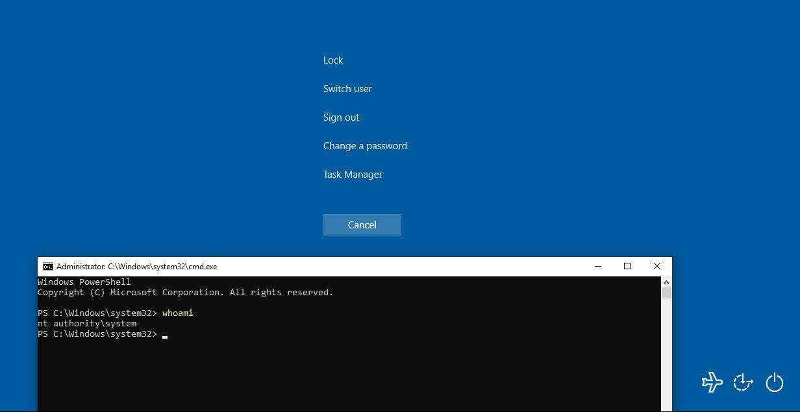

_**May 29, 2018**_

# Old Tricks Are Always Useful: Exploiting Arbitrary File Writes with Accessibility Tools

Historically, replacing built-in accessibility tools is a well-known technique to circumvent the security of the Windows login screen. This can be very helpful if we lose the user's password but we have physical access to the machine, but are you aware that, given few preconditions, this can be also used to exploit remote machines when combined with arbitrary file writes?

## Introduction

A well-known technique to get access to machines where we forgot the login password is to physically unmount the hard drive, attach it to another workstation and replace the `C:\Windows\System32\sethc.exe` binary with `cmd.exe`. After doing that, we can put back the hard drive in the original machine and proceed again to the login screen, where this time we can abuse the "sticky keys" (i.e. pressing five times SHIFT) to pop up a command prompt running as `NT AUTHORITY\SYSTEM` and change the forgotten password ourselves. The same concept can be applied in scenarios where an Arbitrary File Write vulnerability exists in order to achieve command execution at the highest privilege role available.

## Binary Replacement on Windows XP+

`sethc.exe` is not the only binary available for this purpose, the list of accessibility features executables includes:

| Feature | Executable |
|---|---|
| Sticky Keys | `C:\Windows\System32\sethc.exe` |
| Accessibility Menu | `C:\Windows\System32\utilman.exe` |
| On-Screen Keyboard | `C:\Windows\System32\osk.exe` |
| Magnifier | `C:\Windows\System32\Magnify.exe` |
| Narrator | `C:\Windows\System32\Narrator.exe` |
| Display Switcher | `C:\Windows\System32\DisplaySwitch.exe` |
| App Switcher | `C:\Windows\System32\AtBroker.exe` |

An adversary can replace one of those executables by using an Arbitrary File Write vulnerability to escalate his/her privileges to `NT AUTHORITY\SYSTEM`.

## DLL Hijack on Windows 10

On Windows 10, we can adopt a variation of this attack by exploiting a known, but not very documented on the Internet, DLL hijack vulnerability present in the On-Screen Keyboard `osk.exe` executable.

In particular, when `osk.exe` is executed it looks for a `HID.dll` library. The original DLL is present at location `C:\Windows\System32\hid.dll` but `osk.exe` first looks for it at `C:\Program Files\Common Files\microsoft shared\ink\HID.dll`.

By planting a malicious DLL at that location, we can intercept the `LoadLibrary` call and achieve command execution in the context of the user running `osk.exe` without messing up with the original executable, effectively avoiding breaking any existing accessibility feature and skipping _in toto_ noisy executable replacements in `C:\Windows\System32`.

## Exploit Remote Machines with RDP

This technique can also be used when the adversary doesn't have physical access to the target machine via the Remote Desktop Protocol (RDP). For example, let's imaging a scenario where we have access to a remote workstation where we can use an Arbitrary File Write vulnerability to plant our malicious DLL. In the past, there were some known, handy techniques used to kick off the execution of our DLL as `NT AUTHORITY\SYSTEM` but they were patched, such as:

- DiagHub: [https://googleprojectzero.blogspot.com/2018/04/windows-exploitation-tricks-exploiting.html](https://googleprojectzero.blogspot.com/2018/04/windows-exploitation-tricks-exploiting.html)
- UsoSvc: [https://itm4n.github.io/usodllloader-part1/](https://itm4n.github.io/usodllloader-part1/)

We may still have a possibility to abuse the accessibility tools to load our EXE/DLL by using the techniques showed above, but we need to face with the two following requirements:

1. RDP is enabled
2. **if NLA is enabled**, we need valid credentials of a `Remote Desktop User` group member or equivalent

### Without NLA

If NLA is not enabled, we can simply connect locally to the RDP service without any credentials and trigger the On-Screen Keyboard from the login screen within the RDP session.

### With NLA

If NLA is enabled, we need valid credentials in order to reach the graphical interface within the RDP session. After we have successfully authenticated, we can trigger the creation of an On-Screen Keyboard instance by `NT AUTHORITY\SYSTEM` by manually locking the session to access the login screen or by typing the following sequence:

1. [Win+R]
2. osk.exe
3. [Enter]
4. [Ctrl+Alt+Del]

## Tips & Tricks

During my experiments, I discovered some tricks that I would like to share:

- to connect to the local RDP service with the built-in RDP client, we need to specify `127.0.0.2` as destination since `127.0.0.1` and `localhost` are blocked by hardcoded checks in the client itself.
- if NLA is enabled and the user we have the credentials of is already logged in, we can still trigger the On-Screen Keyboard by `NT AUTHORITY\SYSTEM` by pressing [Win+U] when the error message is displayed before the forced disconnection.

## Conclusion

Abusing built-in accessibility tools is a well-known technique that you should be aware of and protect yourself from. This particular technique is also described as [T1015](https://attack.mitre.org/techniques/T1015/) in the [MITRE ATT&CK](https://attack.mitre.org/) framework.

[back](../)
