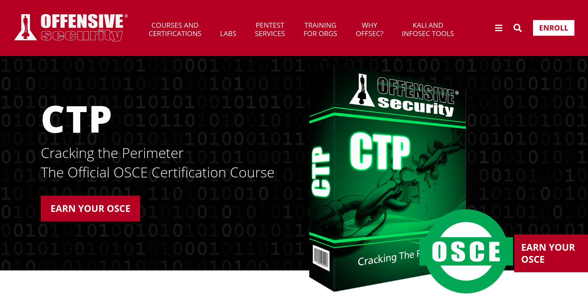

_**Jan 07, 2020**_

# Cracking the Perimeter (CTP) and Offensive Security Certified Expert (OSCE) Preparation Guide

In 2018 I got the [_Offensive Security Certified Professional_](https://www.offensive-security.com/pwk-oscp/) (OSCP) certification. I was very satisfied with it since it's one of the best entry level hands-on certification for the InfoSec sector. This year I decided to continue further by attending the _Cracking the Perimeter_ (CTP) Course and move forward to the [_Offensive Security Certified Professional_](https://www.offensive-security.com/ctp-osce/) (OSCE) certification.



## Syllabus

1. **Introduction**
1. **The Web Application Angle**
    1. _Cross Site Scripting Attacks – Scenario #1_
    1. _Real World Scenario_
    1. _Directory traversal – Scenario #2_
    1. _Real World Scenario_
1. **The Backdoor Angle**
    1. _Backdooring PE files under Windows Vista_
1. **Advanced Exploitation Techniques**
    1. _MS07-017 – Dealing with Vista_
    1. _Cracking the Egghunter_
1. **The 0Day Angle**
    1. _Windows TFTP Server – Case study #1_
    1. _HP Openview NNM – Case study #2_
1. **The Networking Angle – Attacking the Infrastructure**
    1. _Bypassing Cisco Access Lists using Spoofed SNMP Requests_
    1. _GRE Route-Map Kung Fu_
    1. _Sniffing Remote Traffic via GRE tunnel_
    1. _Compromised Router Config_

You can grab a PDF copy of the syllabus [here](https://www.offensive-security.com/documentation/cracking-the-perimeter-syllabus.pdf).

## Description

The course is comprehensive of 3.5 hours of video lessons, 145 pages of documental material and a virtual lab that you can connect to over a VPN connection. There are 5 main topics that are presented:

1. The Web Application Angle
1. The Backdoor Angle
1. Advanced Exploitation Techniques
1. The 0Day Angle
1. The Networking Angle – Attacking the Infrastructure

In each section, you will receive a theoretical explaination and a hands-on demo. You are supposed to replicate the pratical exercises in the virtual lab while you are progressing during the course. In this way you can confirm that you have understood everything correctly and immediately clarify any potential doubt.

## Prerequisites

During the lessons, the instructor teaches you step by step the techniques that you will have to master in order to pass the final exam. Since it's an intermediate course, the speaker assumes some background knowledge in order to keep the explaination straight forward and on the topic. This is by design and if you feel that you are missing something during the lessons, you should pause and start a personal research on the topic since it's your responsibility to ensure that you have all the prerequisites needed for a profitable learning. In particular, you will need to have a basic knowledge of the x86 assembly, some experiences with binary exploitation on Windows and how to use a debugger like [OllyDbg](http://www.ollydbg.de/) or [Immunity Debugger](https://www.immunityinc.com/products/debugger/). ([mona.py](https://github.com/corelan/mona) FTW!)

### Registration

As for the OSCP certification, you have to enroll with a verified email address: accademic or business accounts are accepted and they require time in order to be verified so keep it in mind if you are planning to register. Also, you will have to solve a simple 2-steps challenge during the enroll form. After everything is done, you will be able to choose a start date between one and two weeks from the registration day. For these reasons, it is suggested to register two or three weeks before the planned starting date.

## Acquired Skills

The course aims to teach the candidate various concepts and techniques regarding the following topics:

- AV evasion
- x86 shellcoding
- egghunting
- SEH based binary exploitation
- web based exploitation

I can confirm that, despite the fact that I already had some experience with binary exploitation and egghunting, now I have a complete and deep knowledge about all the internals involved in the process of exploiting non trivial stack-based buffer overflows.

I also have learned how to automate the fuzzing of native application in order to discover potential unknown bugs aka 0days.

Additionally, I am now able to write, assemble and debug my own x86 shellcode, thanks to the advanced SEH exploitation exercises that I have practice with during the learning period.

I also have now a basic knowledge regarding AV evasion techniques that involve Portable Executable (PE) and encoding/decoding stubs.

## Exam

The exam consist in a 48 hours practical challenge where you have to solve multiple machines using similar techniques to the ones shown during the course itself. The course is meant to introduce the candidate to the basic concepts that can be later used by him/her to proceed further in the learning process. After the practical part, the candidate has 24 hours more to write and send the complete final report where every step is described by a technical explaination and supported by screenshots.

Some suggestions for the exam are:

- Sleep sufficient hours before the exam day
- Start in the morning if you can
- Start documenting all the steps with screenshot during the exam itself
- Practice a lot on different exercises ahead of time to ensure a broader knowledge than the strictly required to pass the exam
- If you get enough points to pass the exam few hours before the end time, pass few minutes to check that if you have all the required screenshots before attempting the last task
- Read more than once the exam text to be sure that every detail and requirement is well understood

## Preparation

While watching the lessons, try to replicate the attacks in the virtual lab in order to confirm that you understood correctly. After you have completed the course, start googling for similar exercises in order to boost your experience with different scenarios. Before trying any practical task, ensure that you have enough knowledge to understand what and how you are trying to achieve it. If something seems not clear, stop the lessons and start researching the topic on your own to fill the gap and solve the puzzle in your head.

### x86 Assembly

You can practice your shellcoding skills in a C program in the following way:

```c
__declspec(naked) void shellcode(void)
{
    __asm
    {
        // AT&T syntax!
        int 3 // stop the debugger
        mov 1, eax
        mov 2, ebx
        add eax, ebx
        ret
    }
}

int main(void) {
    shellcode();
    return 0;
}
```

or by executing raw shellcode in this other way:

```c
// msfvenom -p windows/exec cmd=calc.exe -f c
char code[] = "\xcc" // stop the debugger
"\xfc\xe8\x82\x00\x00\x00\x60\x89\xe5\x31\xc0\x64\x8b\x50\x30"
"\x8b\x52\x0c\x8b\x52\x14\x8b\x72\x28\x0f\xb7\x4a\x26\x31\xff"
"\xac\x3c\x61\x7c\x02\x2c\x20\xc1\xcf\x0d\x01\xc7\xe2\xf2\x52"
"\x57\x8b\x52\x10\x8b\x4a\x3c\x8b\x4c\x11\x78\xe3\x48\x01\xd1"
"\x51\x8b\x59\x20\x01\xd3\x8b\x49\x18\xe3\x3a\x49\x8b\x34\x8b"
"\x01\xd6\x31\xff\xac\xc1\xcf\x0d\x01\xc7\x38\xe0\x75\xf6\x03"
"\x7d\xf8\x3b\x7d\x24\x75\xe4\x58\x8b\x58\x24\x01\xd3\x66\x8b"
"\x0c\x4b\x8b\x58\x1c\x01\xd3\x8b\x04\x8b\x01\xd0\x89\x44\x24"
"\x24\x5b\x5b\x61\x59\x5a\x51\xff\xe0\x5f\x5f\x5a\x8b\x12\xeb"
"\x8d\x5d\x6a\x01\x8d\x85\xb2\x00\x00\x00\x50\x68\x31\x8b\x6f"
"\x87\xff\xd5\xbb\xf0\xb5\xa2\x56\x68\xa6\x95\xbd\x9d\xff\xd5"
"\x3c\x06\x7c\x0a\x80\xfb\xe0\x75\x05\xbb\x47\x13\x72\x6f\x6a"
"\x00\x53\xff\xd5\x63\x61\x6c\x63\x2e\x65\x78\x65\x00";

int main(int argc, char **argv)
{
  void *exec = VirtualAlloc(0, sizeof code, MEM_COMMIT, PAGE_EXECUTE_READWRITE);
  memcpy(exec, code, sizeof(code));
  ((void(*)())exec)();
}
```

### AV Evasion

In order to practice with this task, you can create yourself a simple C program that contains some data that triggers a predefined signature. For instance, you can implement a program that prints an hardcoded EICAR string to the standard output and try to evade the detection using the technique shown in the course without altering the functionality of the program itself.
On GNU/Linux systems, you can check if the signature is still present with the following command:

`grep -a EICAR test.exe && echo detected || echo not detected`

### Shellcoding and Custom Encoders

During the course, a specific technique is shown to manually encode arbitrary shellcode in an alphanumeric fashion. You can practice with it by replicating the exact same exploit shown in the course or by trying the famous [QuickZip 4.60 SEH Overflow Exploit](https://iwantmore.pizza/posts/quickzip-seh-win10-wow64.html).

After you have understood the encoding and decoding processes and tried it manually a couple of times, you can try to automate the flow by coding your first, very own encoder.

For reference, I wrote a JavaScript x86 alpha-numeric encoder that you can find and try online here:

- [x86 ASCII AND-SUB Encoder](https://iwantmore.pizza/posts/and-sub-encoder.html)

### SEH Exploitation

I have first try to replicate the exploits shown in the course and after that I search on [Exploit-DB](https://www.exploit-db.com/) for other exercises to practice with.

Here you can find a [list of exploits](https://github.com/phra/seh-exploits) (re)solved by me during my preparation that I suggest to try yourself:

- [docPrint Pro 8.0 - SEH Buffer Overflow](https://www.exploit-db.com/exploits/47394) - [(solution)](https://github.com/phra/seh-exploits/tree/master/docprint)
- [Foxit Reader 4.1.1 - Local Stack Overflow](https://www.exploit-db.com/exploits/15542) - [(solution)](https://github.com/phra/seh-exploits/tree/master/foxit-reader)
- [LanSpy 2.0.1.159 - Buffer Overflow](https://github.com/phra/seh-exploits/tree/master/lanspy) - [(solution)](https://www.exploit-db.com/exploits/46018)
- [QuickZip 4.x - '.zip' Local Universal Buffer Overflow](https://www.exploit-db.com/exploits/11656) - [(solution for win10 wow64)](https://github.com/phra/seh-exploits/tree/master/quickzip) [(nice writeup by knapsy)](https://blog.knapsy.com/blog/2017/05/01/quickzip-4-dot-60-win7-x64-seh-overflow-egghunter-with-custom-encoder/)
- [Vulnserver Exploiting GMON with SEH Overwrite](https://anubissec.github.io/Vulnserver-Exploiting-GMON-SEH-Overwrite/#) - [(solution)](https://github.com/phra/seh-exploits/tree/master/vulnserver)

## General Tips

Here there are some tips'n'tricks discovered during the preparation that I would like to share with the future candidates that can help to save some time in manual, repetitive tasks.

### Shellcode Generation

There are a lot of ways to generate shellcode from assembly instructions. Personally, I have used the [Metasm](https://github.com/jjyg/metasm) project to quickly prototype my shellcode and [NASM](https://www.nasm.us/) for more stable and elaborated codes:

- Metasm

```text
$ msf-metasm_shell
type "exit" or "quit" to quit
use ";" or "\n" for newline
type "file <file>" to parse a GAS assembler source file

metasm > je $-99; jne $-97;
"\x74\x9b\x75\x9d"
```

- NASM

```nasm
; egghunter win10 wow64
; tested on Microsoft Windows 1809 [Version 10.0.17763.805]
; build it with:
; nasm -felf32 egghunter.asm -o egghunter.o && for i in $(objdump -d ./egghunter.o | tr '\t' ' ' | tr ' ' '\n' | egrep '^[0-9a-f]{2}$') ; do echo -ne "\x$i" ; done | msfvenom -p- --arch x86 --platform windows -e x86/alpha_mixed BUFFERREGISTER=eax

BITS 32
global _start
section .text

_start:
    mov    ebx, cs
    cmp    bl, 0x23
    xor    edx, edx
page_invalid:
    or     dx, 0xfff
page_valid:
    xor    ebx, ebx
    inc    edx
    push   ebx ; added
    push   ebx ; added
    push   edx
    push   ebx
    push   ebx
    push   ebx
    push   0x29
    pop    eax
    mov    bl, 0xc0
    call   DWORD [fs:ebx]
    add    esp, 0x0c
    pop    edx
    add    esp, 0x8 ; added
    cmp    al, 0x5
    je     page_invalid
    mov    eax, 0x74303077 ; w00t
    mov    edi, edx
    scasd
    jne    page_valid ; adjusted
    scasd
    jne    page_valid ; adjusted
    jmp    edi
```

To disassemble machine code, I have used NDISASM:

```text
$ msfvenom -p windows/exec CMD=calc.exe | ndisasm -b32 -
[-] No platform was selected, choosing Msf::Module::Platform::Windows from the payload
[-] No arch selected, selecting arch: x86 from the payload
No encoder or badchars specified, outputting raw payload
Payload size: 193 bytes

00000000  FC                cld
00000001  E882000000        call 0x88
00000006  60                pusha
00000007  89E5              mov ebp,esp
00000009  31C0              xor eax,eax
...
```

For your information, you can also avoid to hardcode any machine code in your exploit and use [pwntools](https://docs.pwntools.com/en/stable/) features to assemble it at runtime.

```python
from pwntools import asm

asm('mov eax, 0') # => '\xb8\x00\x00\x00\x00'
```

### Useful mona.py Commands

I strongly suggest to use the mona.py script with Immunity Debugger in order to speed up some manual tasks required during the buffer overflow exploitation process. Some useful commands that I often used are:

- `!mona findmsf`: search various places for the Metasploit pattern, returning the resulting offset for all the matches

- `!mona seh`: search the memory for all the gadgets that we can use as Structured Exception Handler and automatically categorize them in the following groups depending on their properties:
  - _unicode_ (this will include unicode transforms as well)
  - _ascii_
  - _asciiprint_
  - _upper_
  - _lower_
  - _uppernum_
  - _lowernum_
  - _numeric_
  - _alphanum_
  - _nonull_
  - _startswithnull_

- `!mona egg -t w00t`: generate the traditional 32 bits egghunter

- `!mona jmp -r <REG>`: find all the gadget to perform a jmp into the specified register

- `!mona cmp -a <ADDR> -f <FILE>`: it compares a chunk of memory with a specified file on disk in order to detected potential truncations or bad characters and displays a nice matrix to present the results.

## Feedback

I really enjoyed this course from the very beginning since you will have to deal with advanced technical topics and low level challenges. After having finished it, I can affirm that I learned a lot from it and this knowledge will be fundamental to study and research more advanced topics, such as exploitation mitigations and protections of modern Windows versions.
I really suggest to attend the Cracking the Perimeter course if you are interested in this field, you won't regret it.

## Useful Resources

- [The Beginners Guide to Codecaves](https://www.codeproject.com/Articles/20240/The-Beginners-Guide-to-Codecaves)
- [Backdooring PE Files - Part 1](https://sector876.blogspot.com/2013/03/backdooring-pe-files-part-1.html)
- [Backdooring PE Files - Part 2](https://sector876.blogspot.com/2013/03/backdooring-pe-files-part-2.html)
- [Exploit writing tutorial part 8: Win32 Egg Hunting](https://www.corelan.be/index.php/2010/01/09/exploit-writing-tutorial-part-8-win32-egg-hunting/)
- [Exploit writing tutorial part 9: Win32 Shellcoding](https://www.corelan.be/index.php/2010/02/25/exploit-writing-tutorial-part-9-introduction-to-win32-shellcoding/)
- [DEF CON 16 - Mati Aharoni: BackTrack Foo - From bug to 0day](https://www.youtube.com/watch?v=axTthxE-z6A)
- [Introductory Exploit Development Live Stream - x86 Assembly Primer and SEH Overflows](https://www.youtube.com/watch?v=cpmdqMbEJyA)

[back](../)
