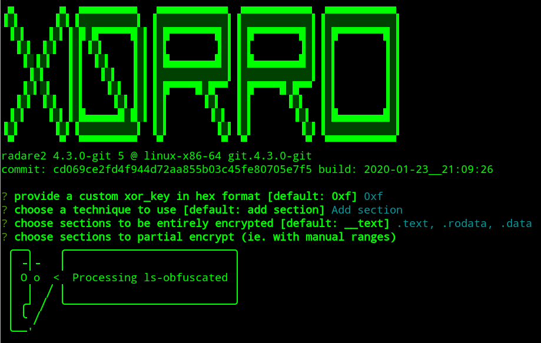

_**Feb 04, 2020**_

# x0rro — A PE/ELF/MachO Crypter for x86 and x86_64 Based on Radare2

Often AV software relies on simple signatures to detect malicious software and I needed an automated tool in order to confirm this behaviour and be able to quickly produce a working bypass. That's why I wrote [x0rro](https://github.com/phra/x0rro), a simple crypter based on [Radare2](https://rada.re/n/) that supports both x86 and x86_64 architectures for PE, ELF and MachO executable formats.

<script id="asciicast-q2xcnup5QZruzQiRbSGud9Uig" src="https://asciinema.org/a/q2xcnup5QZruzQiRbSGud9Uig.js" async></script>

## Design

Let's identify our requirements in order to kick off the design phase:

1. As our ideal use case, we want to be able to take an existing executable that prints the string _Hello World!_ to stdout and produce a variant that doesn't include anymore the string in the binary itself but still correctly prints it.

1. Our goal is to be able to quickly produce variations of the same binary while maintaining its original behaviour.

1. As a requirement, we would like to implement a solution that supports multiple operating systems and architectures.

1. We also want to be able to select which sections of the executable binary we want to alter, potentially selecting only portions of specific sections.

1. As a nice to have, we would like to avoid including specific libraries to deal with single executable formats and keep the codebase as much generic as we can.

1. Another feature that we would like to have is the ability to choose between using a code cave or adding a new section to place our stub.

1. Since we want to achieve a simple signature bypass, we won't include any kind of anti-debug or anti-sandbox features in our crypter.

## Research & Development

In order to fulfill our requirements, I decided to implement a software based on [Radare2](https://rada.re/n/), the _Libre and Portable Reverse Engineering Framework_.

I chose [TypeScript](https://www.typescriptlang.org/) as language and [NodeJS](https://nodejs.org) as runtime to be able to quickly prototype a Proof of Concept and the library [R2Pipe](https://github.com/radareorg/radare2-r2pipe) to communicate with Radare2 (there are bindings available for the major languages, including JavaScript (NodeJS) and Python).

For some functionalities there are currently not available in Radare2, such as adding segments/sections and changing their permissions, we will resort on the Python library [LIEF](https://lief.quarkslab.com/doc/latest/api/python/index.html).

In order to obfuscate specific regions of the executable, we will use a simple _1-byte XOR encryption_, that will be just enough to bypass static signatures: the main idea is to XOR them ahead of time and insert an assembly stub that will do the decryption at runtime.

On Linux and Mac Os X, we also need to invoke the `mprotect` syscall in order to enable `rwx` permissions on the memory pages that we want to encrypt/decrypt.

We also need to produce a valid Position Indipendent Code for our stub in order to support PIE executables:

- for x86, we need to manually calculate relative offset from the current `EIP` register and retrieve in first place the register value by using the `call/pop` trick.
- for x86_64, the architecture natively supports `RIP` relative addressing, so we don't need to manually calculate the offset

The template for the x86 Linux will be something similar to the following:

```nasm
; i386 syscall args: ebx ecx edx esi edi ebp
; 0x7d i386 mprotect { int mprotect(caddr_t addr, size_t len, int prot); }

_save_registers:
    push edx
    push ecx
    push ebx
    push eax
    push ebp
_call_get_eip:
    call _get_eip:
_get_eip:
    pop ebp
{{#sections_xor}}
    mov edx, 0x7 ; rwx
    mov ecx, {{{psize}}}
    lea ebx, [ebp + {{{page_start}}}]
    mov eax, 0x7d ; mprotect linux
    int 0x80
    lea edi, [ebp + {{{vaddr}}}]
    mov ecx, edi
    add ecx, {{{vsize}}}
_xor_loop{{{name}}}:
    xor byte ptr [edi], {{{xor_key}}}
    inc edi
    cmp edi, ecx
    jl _xor_loop{{{name}}}
{{/sections_xor}}
_restore_registers:
    lea edi, [ebp + {{{entry_point}}}]
    pop ebp
    pop eax
    pop ebx
    pop ecx
    pop edx
_jmp_back:
    jmp edi
```

and for x86_64 Linux:

```nasm
; parameter order is: %rdi, %rsi, %rdx, %rcx, %r8, %r9, then push the rest on the stack in reverse order
; 74 AUE_MPROTECT { int mprotect(caddr_t addr, size_t len, int prot); }

_save_registers:
    push rdi
    push rsi
    push rdx
    push rcx
    push rax
{{#sections_xor}}
    lea rdi, [{{{page_start}}}]
    mov rsi, {{{psize}}}
    mov rdx, 0x7 ; rwx
    mov rax, 10 ; mprotect linux
    syscall
    lea rdi, [{{{vaddr}}}]
    mov rcx, rdi
    add rcx, {{{vsize}}}
_xor_loop{{{name}}}:
    xor byte ptr [rdi], {{{xor_key}}}
    inc rdi
    cmp rdi, rcx
    jl _xor_loop{{{name}}}
{{/sections_xor}}
_restore_registers:
    pop rax
    pop rcx
    pop rdx
    pop rsi
    pop rdi
_jmp_back:
    jmp {{{entry_point}}}

```

## x0rro

After a couple of weeks of development, [x0rro](https://github.com/phra/x0rro) is now ready to be released and it supports the three major executable formats, i.e. ELF/PE/MachO, and both x86 and x86_64 architectures as per our requirements. Feel free to grab the source from GitHub or installing it directly with NPM.

Install Radare2 from `master` branch and make it available on the `$PATH`:

```bash
git clone --depth=1 https://github.com/radareorg/radare2.git
cd radare2
sys/user.sh
export PATH=~/bin/:$PATH
```

From sources:

```bash
git clone https://github.com/phra/x0rro.git
cd x0rro
npm i
./bin/run -h
```

From NPM:

```bash
npm i -g x0rro --ignore-scripts
x0rro -h
```

To view the usage of all the available commands, you can use the `-h` switch:

```bash
x0rro -h
x0rro cave -h
x0rro section -h
x0rro interactive -h
```

An example using the code cave technique to encrypt the .rodata section:

```bash
x0rro cave -s rodata my_file
```

And by adding a new section instead:

```bash
x0rro section -s rodata my_file
```

We can achieve the same result by using the interactive wizard, as shown here:

```bash
x0rro interactive my_file
```



[back](../)
