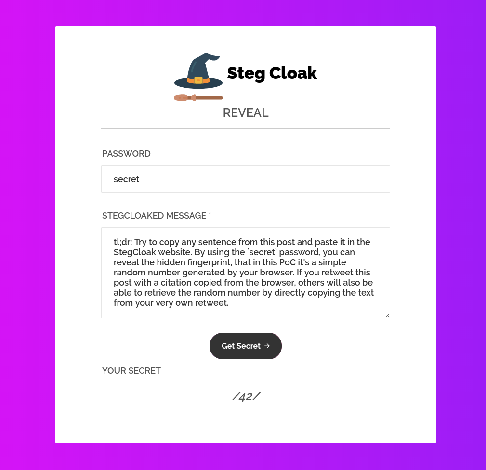

_**Jun 2, 2020**_

# Zero-Width Characters (ZWC) Fingerprinting — What is it and how can we protect from this tracking technique?

> tl;dr: Try to copy any sentence from this post and paste it in the StegCloak [website](https://stegcloak.surge.sh/). By using the `secret` password, you can reveal the hidden fingerprint, that in this PoC it's a simple random number generated by your browser. If you retweet this post with a citation copied from the browser, others will also be able to retrieve the random number by directly copying the text from your very own retweet.

I've played a bit with the [StegCloak](https://github.com/KuroLabs/stegcloak) library to understand how it can be used by a website to fingerprint its visitors by inserting some hidden data in the text copied via the clipboard. After a short introduction about the special unicode characters used to implement this technique, we will see how a website can track all the copied text by dynamically inserting an hidden watermark within. Ultimately, a browser extension to detect watermarked text copied or pasted via the clipboard is provided.



## Zero-Width Characters

Zero-Width Characters are a special kind of [non-printing character](https://en.wikipedia.org/wiki/Control_character) (NPC) that renders differently from regular ones. For example, they can alter the aspect of previous/following characters, join or disjoin them or they can even not be rendered entirely. Counterintuitively, they are seamlessy transmitted during copy and paste operations. Due to this aspect, they can be used to watermark some text by embedding this special characters in the string and the fingerprint data can potentially travel across heterogeneous channels, e.g. by copying some text from a website and pasting it into a chat.

## StegCloak

> StegCloak is a pure JavaScript steganography module designed in functional programming style, to hide secrets inside text by compressing and encrypting with Zero Width Characters. It can be used to safely watermark strings, invisible scripts on webpages, texts on social media or for any other covert communication. Completely invisible!


[StegCloak](https://github.com/KuroLabs/stegcloak) is able to embed arbitrary data in a compressed, encrypted and/or signed fashion. The data is encoded using seven special zero-width characters, guaranteed to be web safe, taken from the [Unicode - General Punctuation](https://www.utf8-chartable.de/unicode-utf8-table.pl) block, that are:

|Code Point|Name|
|---|---|
|U+200C|_ZERO WIDTH NON-JOINER_
|U+200D|_ZERO WIDTH JOINER_
|U+2060|_WORD JOINER_
|U+2061|_FUNCTION APPLICATION_
|U+2062|_INVISIBLE TIMES_
|U+2063|_INVISIBLE SEPARATOR_
|U+2064|_INVISIBLE PLUS_

An example usage for Node.js can be:

```javascript
// Import the library
const StegCloak = require('stegcloak')
// Initializes with encryption true and hmac false for hiding
const stegcloak = new StegCloak(true, false)
// Hide the secret "42" using the "secret" password
stegcloak.hide('42', 'secret', 'This is a confidential message.')
>> 'This ⁠‍‌‍⁡‌⁡⁢‍⁢⁡‍‌⁣⁡‌⁤⁠⁡⁠‍⁠‍⁠‍⁣⁡‍⁡‍⁠⁡‍‌⁠‍⁠is a confidential message.'
// ^^ watermarked!!
```

We can inspect the hidden data using the `xxd` command:

```bash
$ echo -ne 'This ⁠‍‌‍⁡‌⁡⁢‍⁢is a confidential message.' | xxd
00000000: 5468 6973 20e2 81a0 e280 8de2 808c e280  This ...........
00000010: 8de2 81a1 e280 8ce2 81a1 e281 a2e2 808d  ................
00000020: e281 a2e2 81a1 e280 8de2 808c e281 a3e2  ................
00000030: 81a1 e280 8ce2 81a4 e281 a0e2 81a1 e281  ................
00000040: a0e2 808d e281 a0e2 808d e281 a0e2 808d  ................
00000050: e281 a3e2 81a1 e280 8de2 81a1 e280 8de2  ................
00000060: 81a0 e281 a1e2 808d e280 8ce2 81a0 e280  ................
00000070: 8de2 81a0 6973 2061 2063 6f6e 6669 6465  ....is a confide
00000080: 6e74 6961 6c20 6d65 7373 6167 652e       ntial message.
```

## Fingerprinting

There are two main ways for a website to insert an invisible watermark in its context: server side or client side. In the first case it's simply possible to inspect the data received from the server for suspicious Unicode characters and strip/replace them with some visible ones. In the second case, the watermark is dynamically added via JavaScript, for example at `DOMContentLoaded` or `copy` events, making it harder to detect with a trivial static, data inspection. For example, imagine a website that adds an invisible watermark by using the following code:

```javascript
document.addEventListener('DOMContentLoaded', (event) => {
    const password = 'secret'
    const stegcloak = new StegCloak(true, false)
    const handler = (event) => {
        const selection = document.getSelection().toString()
        const fingerprintData = (Math.random() * 100).toFixed(0).toString()
        const watermarked = stegcloak.hide(fingerprintData, password, selection)
        event.clipboardData.setData('text/plain', watermarked)
        event.preventDefault()
    }

    document.addEventListener('cut', handler)
    document.addEventListener('copy', handler)
})
```

By registering an handler for the `cut` and `copy` events, the `handler()` function will dynamically set the watermark when the data is copied to the clipboard. The very same script is actually running on this page, in fact by copying any sentence from this blog post, a watermark represented by a random number generated by your browser will be added to the copied text. Try yourself to copy few words (at least two words are required by StegCloak) and check on [this website](https://stegcloak.surge.sh/) to reveal your lucky, random number by using the `secret` password.

## Detection

I have created a simple browser extension that, by overriding some built-in prototypes, is able to inspect the data cut/copied/pasted via the clipboard and alert the user in case an hidden watermark is found.
There are multiple ways for a website to set the clipboard data, such as:

1. by calling `document.execCommand('copy')` (adapted from [StackOverflow](https://stackoverflow.com/a/30810322/8006810))

    ```javascript
    function copyTextToClipboard(text) {
        const textArea = document.createElement('textarea')
        textArea.value = text
        document.body.appendChild(textArea)
        textArea.focus()
        textArea.select()
        document.execCommand('copy')
        document.body.removeChild(textArea)
    }

    copyTextToClipboard('my text')
    ```

2. by calling `Clipboard.prototype.write()`

    ```javascript
    navigator.clipboard.writeText('my text')
    ```

3. by calling `DataTransfer.prototype.setData()`

    ```javascript
    document.addEventListener('copy', (event) => {
        event.clipboardData.setData('text/plain', 'my text')
        event.preventDefault()
    })
    ```

We can intercept all of them by:

1. registering an event handler for the `cut`/`copy`/`paste` events and inspecting the data for suspicious characters
2. overriding the function `DataTransfer.prototype.setData()`
3. overriding the functions `Clipboard.prototype.write()`/`Clipboard.prototype.writeText()`

A complete example of the main logic implemented by the extension is reported here:

```javascript
async function detect(ZWCPolicy, ZWCUrl) {
    const req = await fetch(ZWCUrl)
    const ZWC = await req.json()
    const ZWCSet = new Set(ZWC.map(c => c.text))

    function isZWCTracked(text) {
        switch (ZWCPolicy) {
            case 'stegcloak':
            default:
                return text ? /[\u200c\u200d\u2060\u2061\u2062\u2063\u2064]/.test(text) : false
            case 'zwc':
                return text ? text.split('').some(c => ZWCSet.has(c)) : false
            case 'paranoid':
                return text ? /[^\u0000-\u007F]/.test(text) : false
        }
    }

    document.addEventListener('copy', (event) => {
        const selection = document.getSelection().toString()
        if (isZWCTracked(selection)) {
            alert('ZWC Tracking Detected!! [document.addEventListener("copy")]')
        }
    })

    document.addEventListener('cut', (event) => {
        const selection = document.getSelection().toString()
        if (isZWCTracked(selection)) {
            alert('ZWC Tracking Detected!! [document.addEventListener("cut")]')
        }
    })

    document.addEventListener('paste', (event) => {
        const selection = (event.clipboardData || window.clipboardData).getData('text')
        if (isZWCTracked(selection)) {
            alert('ZWC Tracking Detected!! [document.addEventListener("paste")]')
        }
    })

    const setData = DataTransfer.prototype.setData
    DataTransfer.prototype.setData = function mySetData(...args) {
        if (isZWCTracked(args[1])) {
            alert('ZWC Tracking Detected!! [DataTransfer.prototype.setData()]')
        }

        return setData.call(this, ...args)
    }

    const write = Clipboard.prototype.write
    Clipboard.prototype.write = function myWrite(...args) {
        if (isZWCTracked(args[0])) {
            alert('ZWC Tracking Detected!! [Clipboard.prototype.write()]')
        }

        return write.call(this, ...args)
    }

    const writeText = Clipboard.prototype.writeText
    Clipboard.prototype.writeText = function myWriteText(...args) {
        if (isZWCTracked(args[0])) {
            alert('ZWC Tracking Detected!! [Clipboard.prototype.writeText()]')
        }

        return writeText.call(this, ...args)
    }
}
```

Currently, the extension supports three different policies that you can choose from the options menu, that are:

1. StegCloak: detects only the seven characters used by the mentioned library
2. ZWC: detects a lot of zero-width characters collected from [unicode-table.com](https://unicode-table.com/)
3. Paranoid: detects any non ASCII characters

You can find the complete extension at [phra/zero-width-fingerprint-detection-extension](https://github.com/phra/zero-width-fingerprint-detection-extension) on GitHub and you can load it as unpacked extension from the [chrome://extensions](chrome://extensions/) web page.

## References

[https://www.zachaysan.com/writing/2017-12-30-zero-width-characters](https://www.zachaysan.com/writing/2017-12-30-zero-width-characters)

[https://medium.com/@umpox/be-careful-what-you-copy-invisibly-inserting-usernames-into-text-with-zero-width-characters-18b4e6f17b66](https://medium.com/@umpox/be-careful-what-you-copy-invisibly-inserting-usernames-into-text-with-zero-width-characters-18b4e6f17b66)

[https://www.umpox.com/zero-width-detection/](https://www.umpox.com/zero-width-detection/)

[https://www.ghacks.net/2018/04/05/how-to-detect-zero-width-characters-fingerprinting/](https://www.ghacks.net/2018/04/05/how-to-detect-zero-width-characters-fingerprinting/)

[https://stegcloak.surge.sh/](https://stegcloak.surge.sh/)

[back](../)

<script src="../assets/js/stegcloak.min.js"></script>
<script>
    document.addEventListener('DOMContentLoaded', async (event) => {
        const password = 'secret'
        const stegcloak = new StegCloak(true, false)
        const handler = (event) => {
            const selection = document.getSelection().toString()
            const fingerprintData = (Math.random() * 100).toFixed(0).toString()
            const watermarked = stegcloak.hide(fingerprintData, password, selection)
            event.clipboardData.setData('text/plain', watermarked)
            event.preventDefault()
        }

        document.addEventListener('cut', handler)
        document.addEventListener('copy', handler)
    })
</script>
